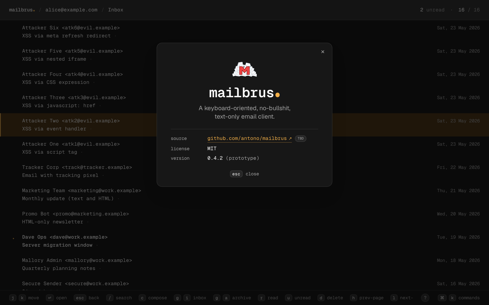
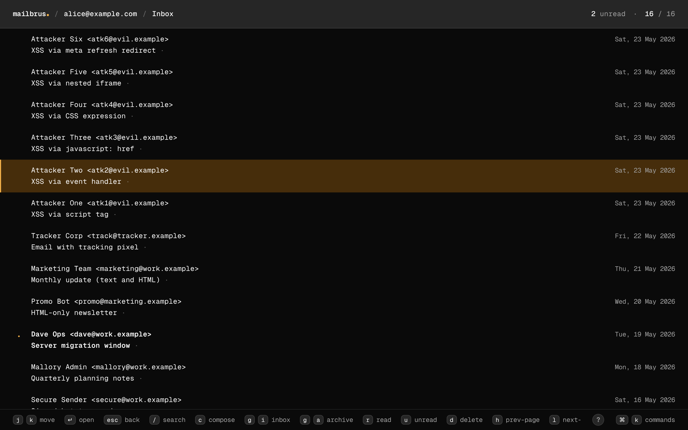
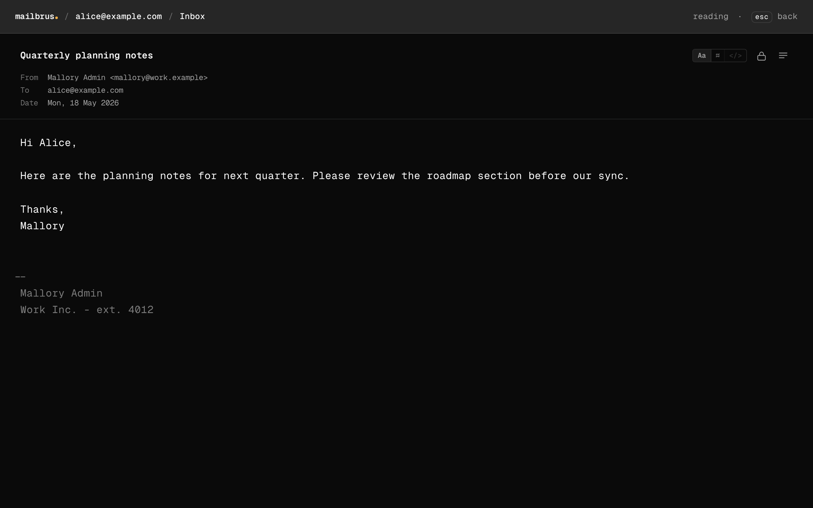
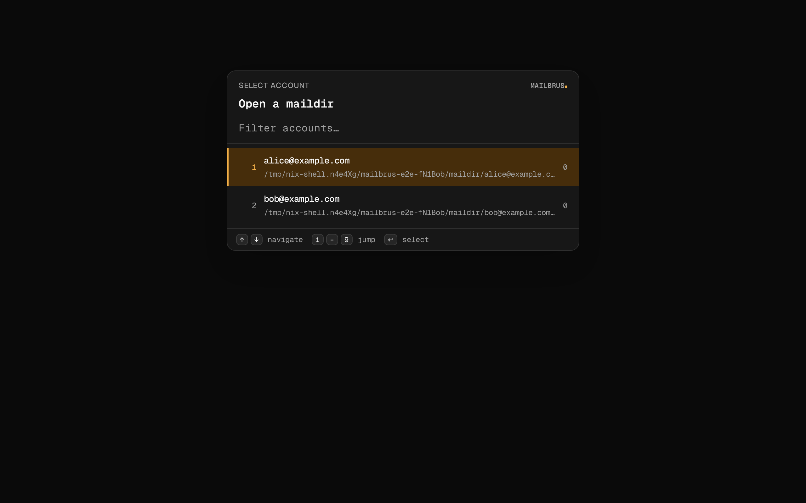
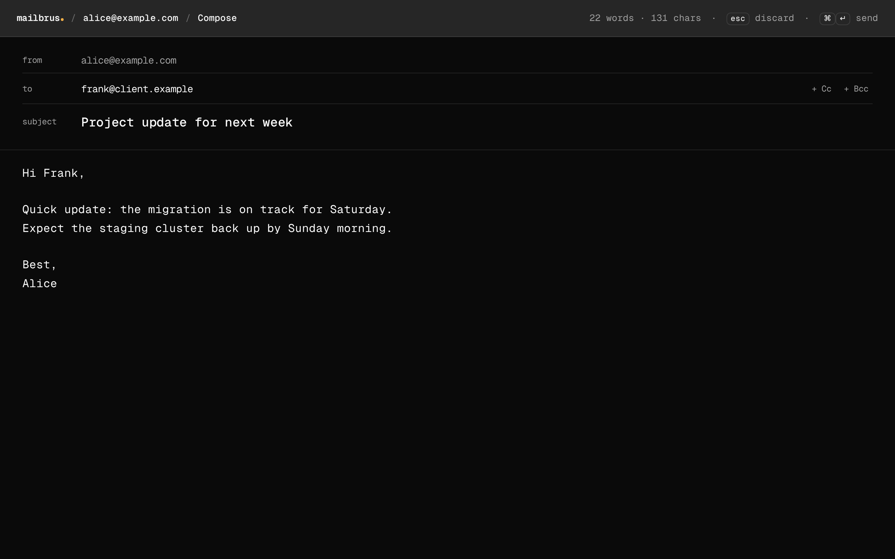
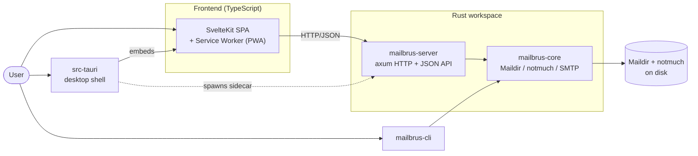

# Mailbrus

Fast mail client with Vim-inspired hotkeys, plain-text-first reading, and offline-capable PWA support.

> 🚧 **WIP** — This is early-stage software. Mail sync and sending are **not yet implemented**.

## Screenshots



<div style="display: flex; flex-wrap: wrap; gap: 8px;">
  <a href="docs/screenshots/message-list.png"></a>
  <a href="docs/screenshots/reader.png"></a>
  <a href="docs/screenshots/accounts.png"></a>
  <a href="docs/screenshots/compose.png"></a>
</div>

## Features

- **Keyboard-first UI** — global hotkeys, leader-key sequences, an `Esc` back-stack, and a `⌘K` command palette.
- **Vimium-style link hints** — `f` overlays single-letter badges on visible rows; press a letter to jump.
- **Fast notmuch-backed search** — full notmuch query syntax with paginated results.
- **Reader + paginated list** — deep-linkable URLs (`/folder/:id`, `/folder/:id/message/:id`, `/search?q=…`), browser back/forward, reload-safe.
- **Attachments** — HTML body parts and binary attachments surfaced uniformly.
- **PWA** — installable manifest, offline app shell, Background Sync outbox for offline send, Web Push for new mail, app-icon unread badge.
- **CLI** — `mailbrus message search` / `message read` with `text`, `json`, and `toon` output formats.
- **Desktop shell** — same SPA wrapped in a Tauri window with a bundled `mailbrus-server` sidecar.

## Architecture



The SPA is the only UI; it runs either in a browser as a PWA or inside a Tauri window where the desktop shell spawns `mailbrus-server` as a sidecar. The server and CLI both go through `mailbrus-core`, which talks to a local Maildir indexed by notmuch.

## Dependencies

- **[Pimalaya](https://github.com/pimalaya)** — the heart of the mail stack. `mailbrus-core` builds on the excellent [`io-email`](https://github.com/pimalaya/io-email) and [`io-maildir`](https://github.com/pimalaya/io-maildir) coroutine libraries; SMTP sending is planned on `io-smtp`. Huge thanks to the Pimalaya project.
- **[notmuch](https://notmuchmail.org/)** — fast, read-only indexed message search via the `notmuch` Rust crate.
- **[Rust](https://www.rust-lang.org/)** — workspace of `mailbrus-core`, `mailbrus-cli`, `mailbrus-server`, and `src-tauri`. Server uses [axum](https://github.com/tokio-rs/axum) on [tokio](https://tokio.rs/); messages are parsed with [`mail-parser`](https://crates.io/crates/mail-parser).
- **[Svelte 5](https://svelte.dev/) + [SvelteKit](https://kit.svelte.dev/)** — the SPA, styled with [Tailwind CSS v4](https://tailwindcss.com/) and [bits-ui](https://bits-ui.com/) primitives.
- **[Tauri 2](https://tauri.app/)** — the desktop shell.
- **[Playwright](https://playwright.dev/)** — end-to-end test runner; tests run inside a [Nix](https://nixos.org/) devShell.

## End-to-End Tests

Mailbrus ships a hermetic Playwright suite that drives the real SPA against a real `mailbrus-server` backed by a real notmuch index — **one freshly cloned mailbox and its own server per test**, with guaranteed teardown. Nothing is mocked: every test exercises the browser → HTTP → notmuch → Maildir path end to end.

```sh
nix develop          # notmuch + Playwright browsers
deno install         # hydrate node_modules
deno task test:e2e   # headless run
deno task e2e:ui     # interactive UI mode
```

See [docs/e2e-testing.md](docs/e2e-testing.md) for the full architecture, fixture model, and trace-debugging workflow.

## Installation

Requires [Nix](https://nixos.org/download) with flakes enabled.

```sh
# Run directly (ephemeral)
nix run github:antono/mailbrus

# Install to your profile
nix profile install github:antono/mailbrus
mailbrus --help
```

See [docs/development.md](docs/development.md) for server usage, CLI flags, and debug logging.
