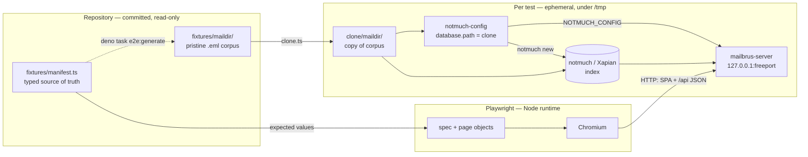
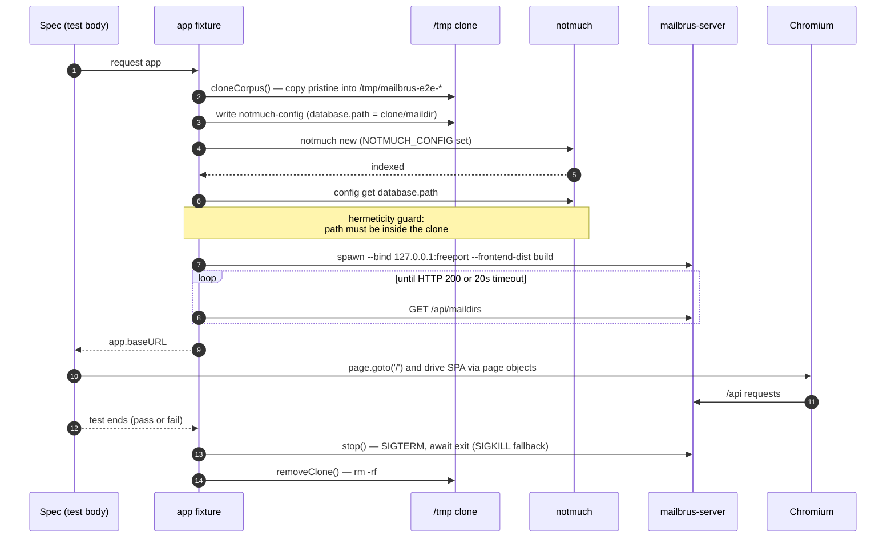
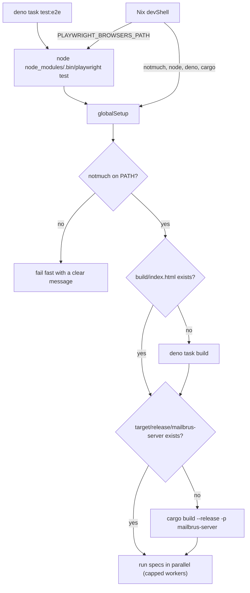
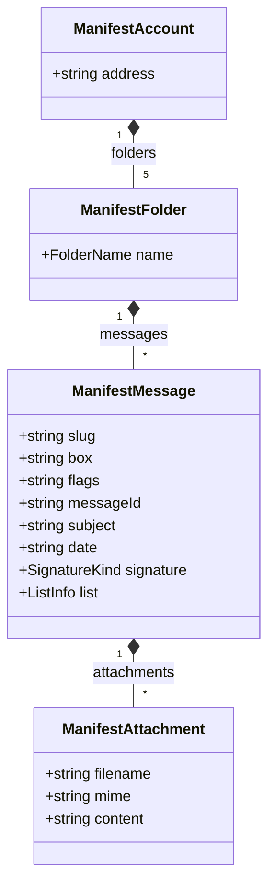
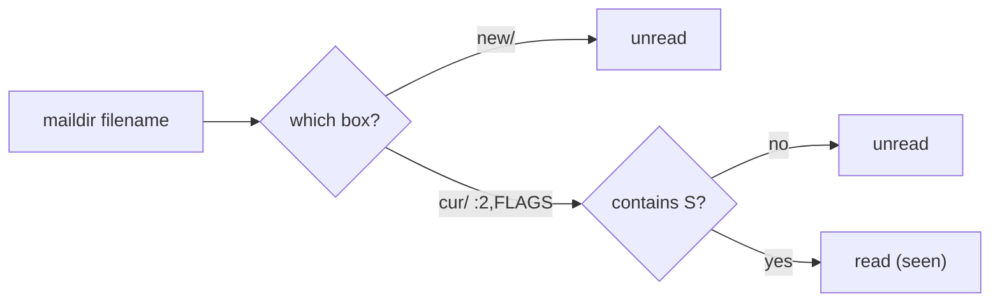
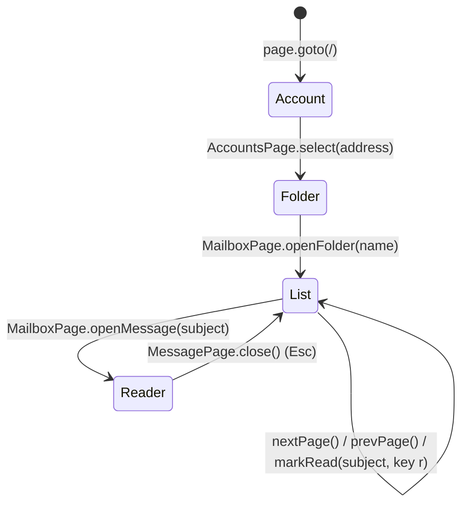

# End-to-End Testing

Mailbrus ships a hermetic, fully isolated **Playwright** end-to-end suite that
drives the real SvelteKit SPA against a real `mailbrus-server` backed by a real
**notmuch** index — one freshly cloned, freshly indexed mailbox **and its own
server per test**, with guaranteed teardown. Nothing is mocked: every test
exercises the browser → HTTP API → notmuch → maildir path end to end.

The suite lives entirely under [`e2e/`](../e2e) and requires **no production
code changes**: per-test isolation is achieved purely through the
`NOTMUCH_CONFIG` environment variable, which the server already uses to resolve
its database.

- **Quick start:** [`e2e/README.md`](../e2e/README.md)
- **Design rationale:** `openspec/changes/playwright-test-suite/`
- **Specs (behaviour):** `openspec/specs/{e2e-test-harness,playwright-e2e-suite,test-maildir-fixtures}`

---

## 1. Architecture at a glance

The committed corpus is **read-only**. For each test the harness copies it into
`/tmp`, indexes that copy with a clone-scoped notmuch config, and points a
dedicated server at it. The browser only ever talks to that per-test server.



Key consequences of this design:

- **Isolation** — two tests never share a database, a server, or a port. One
  test mutating flags or "deleting" a message cannot affect another.
- **Reviewability** — only plain `.eml` files are committed; no binary Xapian
  index lives in git.
- **Hermeticity** — `NOTMUCH_CONFIG` is set explicitly for both the indexer and
  the server, and the harness asserts the resolved `database.path` is inside the
  clone before the test body runs, so the developer's real `~/.notmuch-config`
  and mailbox are never touched.

---

## 2. Directory layout

```
e2e/
  playwright.config.ts     # projects, workers; webServer disabled (harness owns servers)
  tsconfig.json
  fixtures/
    maildir/               # PRISTINE, committed, READ-ONLY corpus (raw .eml, no index)
    manifest.ts            # typed SINGLE SOURCE OF TRUTH
    generate.ts            # materializes maildir/ from manifest.ts
  harness/
    paths.ts               # absolute repo / corpus / build / binary locations
    clone.ts               # copy corpus -> /tmp/mailbrus-e2e-*; recursive cleanup
    notmuch.ts             # scoped notmuch config + `notmuch new` + hermeticity guard
    server.ts              # free port -> spawn server -> health-poll -> stop()
    fixtures.ts            # test.extend({ app }) wiring clone+index+server+teardown
    global-setup.ts        # ensure notmuch / build/ / server binary once per run
  pages/                   # page objects: AccountsPage, MailboxPage, MessagePage
  specs/                   # the tests; assert against the manifest only
```

The maildir tree and `manifest.ts` are the **contract**: specs assert against
the manifest, never against hard-coded literals.

---

## 3. The per-test lifecycle

Setup and teardown live entirely inside the `app` fixture
([`harness/fixtures.ts`](../e2e/harness/fixtures.ts)). Teardown runs in a
`finally`, so the server is stopped and the clone deleted on **both pass and
fail**.



Playwright's `baseURL` is overridden by the fixture to the per-test server, so
specs use relative navigation (`page.goto('/')`).

---

## 4. Toolchain & how a run starts



### Why Node, not Deno, runs the Playwright runner

The project's runtime is Deno, but the Playwright **test runner** is run under
**Node** (`node node_modules/.bin/playwright test`). Running the runner under
Deno's npm compatibility layer is brittle: Playwright's CLI assumes a real Node
process and fails its ESM / `process.versions.node` checks (e.g.
*"Playwright requires Node.js 18.19 or higher"*) even when a modern Node is
installed. This matches the documented fallback in the change's design.

`deno task test:e2e` therefore invokes Node directly. The harness code
(`clone.ts`, `notmuch.ts`, `server.ts`, …) uses only `node:`-prefixed APIs so it
runs cleanly under that Node process.

### Browsers come from Nix

`nix/devshell.nix` exports the Playwright env so browsers are **never downloaded
at runtime**:

| Variable | Value / purpose |
| --- | --- |
| `PLAYWRIGHT_BROWSERS_PATH` | nixpkgs `playwright-driver.browsers` store path |
| `PLAYWRIGHT_SKIP_BROWSER_DOWNLOAD` | `1` — npm never fetches its own browsers |
| `PLAYWRIGHT_SKIP_VALIDATE_HOST_REQUIREMENTS` | `true` — skip the host-deps check (meaningless under Nix) |

`@playwright/test` in `package.json` is **pinned to the same version as
nixpkgs' `playwright-driver`** (currently `1.59.1`). Bumping one without the
other produces the *"browser/runner version mismatch"* error — keep them in
lockstep when upgrading.

---

## 5. The fixture manifest

`manifest.ts` is the single source of truth. `generate.ts` reads it and writes
the committed `.eml` corpus (exact bytes: CRLF, MIME boundaries, the literal
`-- ` signature line). `specs/consistency.spec.ts` proves disk and manifest
stay in lockstep.



Helper predicates in `manifest.ts` are the single place that knows maildir
semantics — `isUnread`, `isFlagged`, `isReplied`, `isTrashed`, `filenameOf`,
`relPathOf`, `messagesNewestFirst`. Specs and the generator both use them, so
filenames and expectations can never drift from the encoded state.

### How message state is encoded

State lives in the maildir **box** (`new/` vs `cur/`) and the **flag letters**
after `:2,` — never in a post-index script.



| Flag | notmuch tag | Meaning | Example fixture |
| --- | --- | --- | --- |
| _(in `new/`)_ | `unread` | never seen | `alice-inbox-02-unread-plain` |
| `S` | _(no `unread`)_ | seen / read | `alice-inbox-01-read-signed` |
| `F` | `flagged` | flagged | `alice-inbox-03-flagged-pdf` (`FS`) |
| `R` | `replied` | replied | `alice-inbox-04-replied-multi` (`RS`) |
| _(in `Trash/`)_ | — | deleted = moved to Trash | `alice-trash-01` |

> Flag letters are written in ASCII order (`F`, `R`, `S`, …). `notmuch new` runs
> with `maildir.synchronize_flags=true`, so these letters become tags
> automatically, and the server derives `unread` from the absence of the
> `unread` tag.

### What the corpus covers

2 accounts (`alice@example.com`, `bob@example.com`), 5 folders each
(`Archive`, `Inbox`, `Sent`, `Spam`, `Trash`), **39 messages** spanning:
read/unread, flagged, replied, trashed, no/one/multiple attachments of differing
MIME types, mailing-list mail (`List-Id` / `List-Unsubscribe`), and
signed / unsigned / broken-signature variants. Alice's `Archive` holds 27
messages specifically so the message list paginates (27 > the SPA's page size of
25).

---

## 6. How the SPA is driven

Mailbrus is a keyboard-driven SPA with a phase state machine (no URL routing).
The page objects in `pages/` encapsulate this navigation so specs read as plain
intent.



| Page object | Screen | Responsibilities |
| --- | --- | --- |
| `AccountsPage` | account picker | list addresses, select an account |
| `MailboxPage` | folder picker + message list | list folders, open a folder, read subjects, paginate, mark read |
| `MessagePage` | reader | subject / from / body, signature state, attachments, unsubscribe |

Page objects only expose locators and intent; **all expected values come from
the manifest**, so a corpus change propagates to assertions automatically.

---

## 7. Running the suite

Use the Nix devShell so notmuch and the Playwright browsers are present and the
env is set:

```sh
nix develop              # or: direnv reload
deno install             # hydrate node_modules (incl. @playwright/test @ 1.59.1)
deno task test:e2e       # headless, parallel
```

| Command | What it does |
| --- | --- |
| `deno task test:e2e` | full suite, headless, parallel (workers capped) |
| `deno task test:e2e-open` | `--headed --workers=1` — one visible browser, sequential, to watch |
| `deno task e2e:generate` | regenerate the `.eml` corpus from `manifest.ts` |

Filter to a subset by appending a pattern, e.g.
`deno task test:e2e-open pagination`.

`global-setup.ts` builds `build/` and `target/release/mailbrus-server` on demand
if they are missing, and fails fast with a clear message if `notmuch` is
unavailable.

### Continuous integration

[`.github/workflows/e2e.yml`](../.github/workflows/e2e.yml) runs the whole flow
through the Nix devShell (so notmuch + browsers come from the flake), with a
capped worker count and the Playwright HTML report uploaded as an artifact.

---

## 8. Adding fixtures and specs

**A fixture message**

1. Add a `ManifestMessage` to the right account/folder in `fixtures/manifest.ts`
   with a unique `slug` **and** a unique `messageId` (notmuch deduplicates on
   `Message-ID`). Encode state via `box` (`new` = unread) and `flags`.
2. Regenerate: `deno task e2e:generate`.
3. `consistency.spec.ts` will fail if disk and manifest diverge.

Never hand-edit the generated `.eml` files — edit the manifest and regenerate.

**A spec**

Import `test` / `expect` from `../harness/fixtures.ts` (this gives you
`app.baseURL` and a per-test server via `page`), drive the UI through the page
objects in `pages/`, and derive every expected value from the manifest. Specs
must contain no inline setup and no hard-coded DOM selectors.

---

## 9. Known UI gaps (`test.fixme`)

Two scenarios are present but marked `test.fixme`. They document real SPA
limitations — the corpus and backend already support them, so each enables the
moment the SPA does. They show as **skipped**, not failed, so the suite stays
green.

| Gap | Why | Backstop |
| --- | --- | --- |
| Attachments never render in the reader | the list API omits attachments and `+page.svelte` discards `fetchMessage().attachments`, so `<Attachments>` always gets `undefined` | `attachments.spec.ts` asserts the **backend** returns them; "no attachments shown" stays green |
| No distinct broken-signature state | the SPA distinguishes only signed vs unsigned (presence of a `-- ` line; see `src/lib/utils.ts` → `splitSignature`); a tampered signature renders as unsigned | the broken variant (`alice-inbox-06`) is committed for when the UI gains the state |

---

## 10. Troubleshooting

| Symptom | Cause / fix |
| --- | --- |
| `Playwright requires Node.js 18.19 or higher` | The runner was launched under Deno's npm shim. Use `deno task test:e2e` (it calls Node directly), not `npx playwright test` via `deno task`. |
| `browserType.launch: Executable doesn't exist` | `PLAYWRIGHT_BROWSERS_PATH` is unset — you're not in the (updated) devShell. Run `nix develop` / `direnv reload`. |
| `browser/runner version mismatch` | `@playwright/test` and nixpkgs `playwright-driver` versions diverged. Re-pin `@playwright/test` to the driver's version. |
| `notmuch is required … not found on PATH` | Run inside `nix develop` (the flake provides notmuch). |
| `hermeticity violation: … outside clone` | A notmuch config leaked from the environment. The harness sets `NOTMUCH_CONFIG` explicitly; ensure nothing overrides it mid-run. |
| Leftover `/tmp/mailbrus-e2e-*` directories | Only on a hard crash mid-test. Safe to delete; the namespaced prefix makes them easy to find. |
