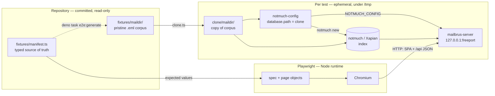
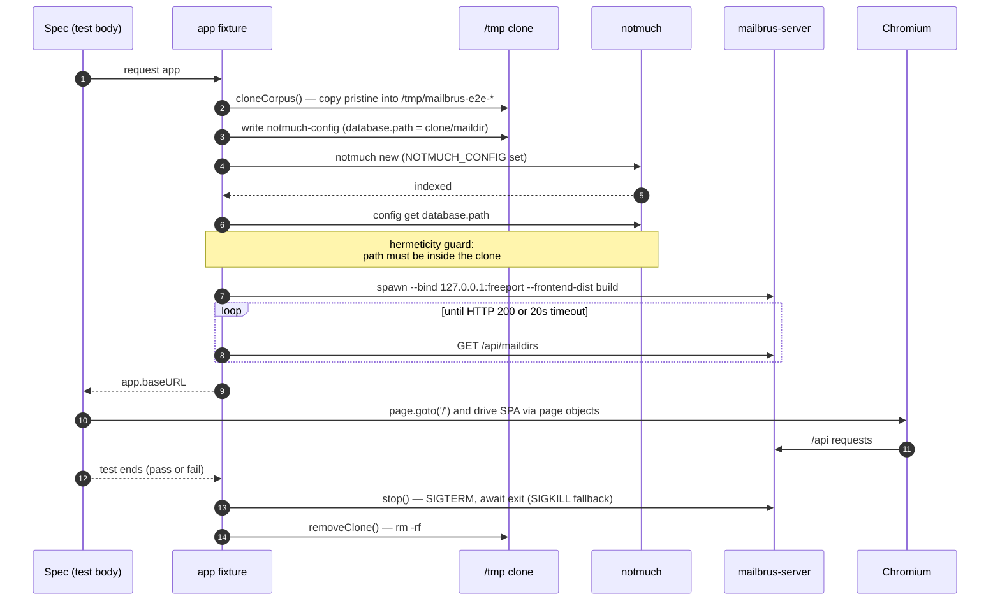
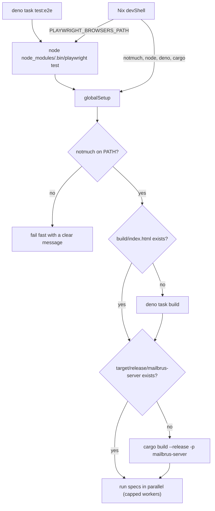
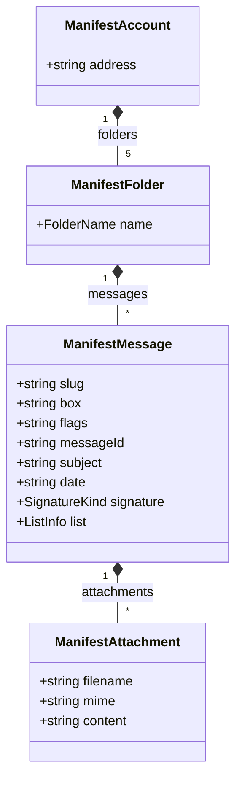
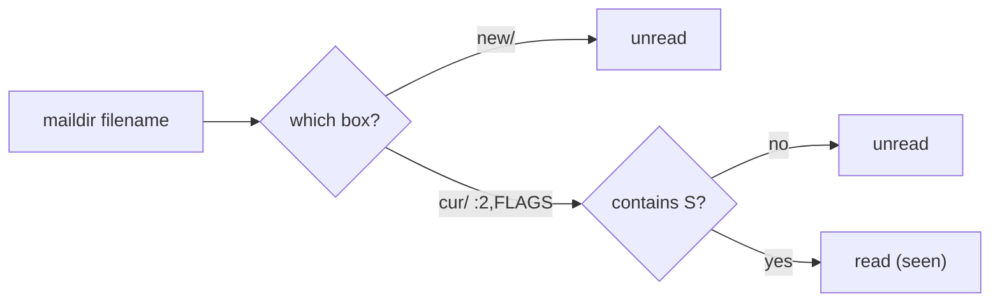
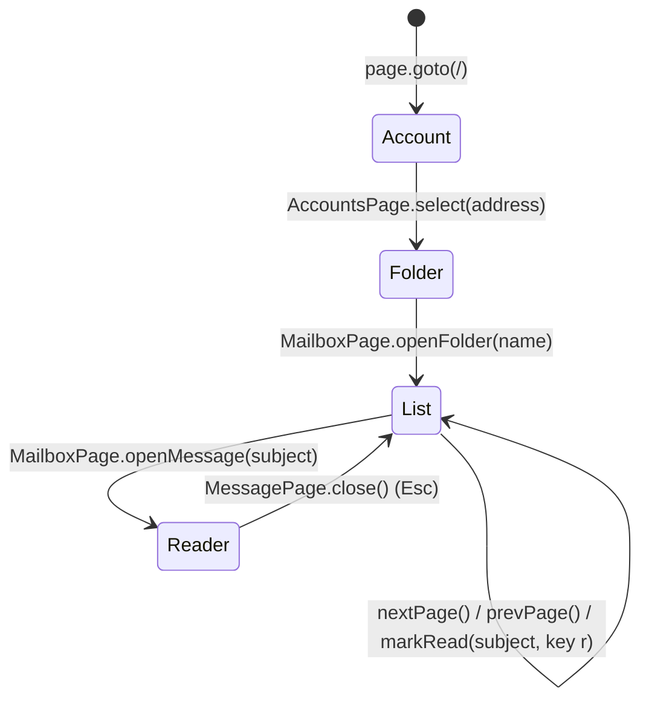
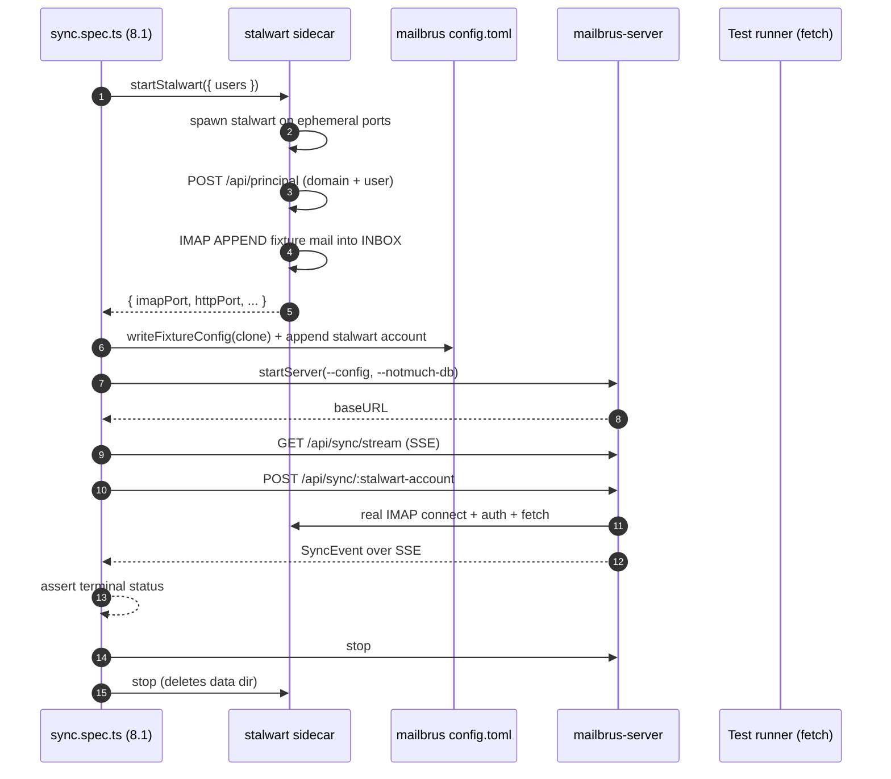

# End-to-End Testing

Mailbrus ships a hermetic, fully isolated **Playwright** end-to-end suite that
drives the real SvelteKit SPA against a real `mailbrus-server` backed by a real
**notmuch** index — one freshly cloned, freshly indexed mailbox **and its own
server per test**, with guaranteed teardown. Nothing is mocked: every test
exercises the browser → HTTP API → notmuch → maildir path end to end.

The suite lives entirely under [`e2e/`](../e2e) and requires **no production
code changes**: per-test isolation is achieved purely through the
`NOTMUCH_CONFIG` environment variable, which the server already uses to resolve
its database.

- **Quick start:** [`e2e/README.md`](../e2e/README.md)
- **Design rationale:** `openspec/changes/playwright-test-suite/`
- **Specs (behaviour):** `openspec/specs/{e2e-test-harness,playwright-e2e-suite,test-maildir-fixtures}`

---

## 1. Architecture at a glance

The committed corpus is **read-only**. For each test the harness copies it into
`/tmp`, indexes that copy with a clone-scoped notmuch config, and points a
dedicated server at it. The browser only ever talks to that per-test server.



Key consequences of this design:

- **Isolation** — two tests never share a database, a server, or a port. One
  test mutating flags or "deleting" a message cannot affect another.
- **Reviewability** — only plain `.eml` files are committed; no binary Xapian
  index lives in git.
- **Hermeticity** — `NOTMUCH_CONFIG` is set explicitly for both the indexer and
  the server, and the harness asserts the resolved `database.path` is inside the
  clone before the test body runs, so the developer's real `~/.notmuch-config`
  and mailbox are never touched.

---

## 2. Directory layout

```
e2e/
  playwright.config.ts     # projects, workers; webServer disabled (harness owns servers)
  tsconfig.json
  fixtures/
    maildir/               # PRISTINE, committed, READ-ONLY corpus (raw .eml, no index)
    manifest.ts            # typed SINGLE SOURCE OF TRUTH
    generate.ts            # materializes maildir/ from manifest.ts
  harness/
    paths.ts               # absolute repo / corpus / build / binary locations
    clone.ts               # copy corpus -> /tmp/mailbrus-e2e-*; recursive cleanup
    notmuch.ts             # scoped notmuch config + `notmuch new` + hermeticity guard
    config.ts              # write a mailbrus config.toml from the cloned corpus
    server.ts              # free port -> spawn server -> health-poll -> stop()
    stalwart.ts            # ephemeral Stalwart IMAP sidecar for sync specs (§ 8)
    fixtures.ts            # test.extend({ app }) wiring clone+index+server+teardown
    global-setup.ts        # ensure notmuch / build/ / server binary once per run
  pages/                   # page objects: AccountsPage, MailboxPage, MessagePage
  specs/                   # the tests; assert against the manifest only
```

The maildir tree and `manifest.ts` are the **contract**: specs assert against
the manifest, never against hard-coded literals.

---

## 3. The per-test lifecycle

Setup and teardown live entirely inside the `app` fixture
([`harness/fixtures.ts`](../e2e/harness/fixtures.ts)). Teardown runs in a
`finally`, so the server is stopped and the clone deleted on **both pass and
fail**.



Playwright's `baseURL` is overridden by the fixture to the per-test server, so
specs use relative navigation (`page.goto('/')`).

---

## 4. Toolchain & how a run starts



### Why Node, not Deno, runs the Playwright runner

The project's runtime is Deno, but the Playwright **test runner** is run under
**Node** (`node node_modules/.bin/playwright test`). Running the runner under
Deno's npm compatibility layer is brittle: Playwright's CLI assumes a real Node
process and fails its ESM / `process.versions.node` checks (e.g.
*"Playwright requires Node.js 18.19 or higher"*) even when a modern Node is
installed. This matches the documented fallback in the change's design.

`deno task test:e2e` therefore invokes Node directly. The harness code
(`clone.ts`, `notmuch.ts`, `server.ts`, …) uses only `node:`-prefixed APIs so it
runs cleanly under that Node process.

### Browsers come from Nix

`nix/devshell.nix` exports the Playwright env so browsers are **never downloaded
at runtime**:

| Variable | Value / purpose |
| --- | --- |
| `PLAYWRIGHT_BROWSERS_PATH` | nixpkgs `playwright-driver.browsers` store path |
| `PLAYWRIGHT_SKIP_BROWSER_DOWNLOAD` | `1` — npm never fetches its own browsers |
| `PLAYWRIGHT_SKIP_VALIDATE_HOST_REQUIREMENTS` | `true` — skip the host-deps check (meaningless under Nix) |

`@playwright/test` in `package.json` is **pinned to the same version as
nixpkgs' `playwright-driver`** (currently `1.59.1`). Bumping one without the
other produces the *"browser/runner version mismatch"* error — keep them in
lockstep when upgrading.

---

## 5. The fixture manifest

`manifest.ts` is the single source of truth. `generate.ts` reads it and writes
the committed `.eml` corpus (exact bytes: CRLF, MIME boundaries, the literal
`-- ` signature line). `specs/consistency.spec.ts` proves disk and manifest
stay in lockstep.



Helper predicates in `manifest.ts` are the single place that knows maildir
semantics — `isUnread`, `isFlagged`, `isReplied`, `isTrashed`, `filenameOf`,
`relPathOf`, `messagesNewestFirst`. Specs and the generator both use them, so
filenames and expectations can never drift from the encoded state.

### How message state is encoded

State lives in the maildir **box** (`new/` vs `cur/`) and the **flag letters**
after `:2,` — never in a post-index script.



| Flag | notmuch tag | Meaning | Example fixture |
| --- | --- | --- | --- |
| _(in `new/`)_ | `unread` | never seen | `alice-inbox-02-unread-plain` |
| `S` | _(no `unread`)_ | seen / read | `alice-inbox-01-read-signed` |
| `F` | `flagged` | flagged | `alice-inbox-03-flagged-pdf` (`FS`) |
| `R` | `replied` | replied | `alice-inbox-04-replied-multi` (`RS`) |
| _(in `Trash/`)_ | — | deleted = moved to Trash | `alice-trash-01` |

> Flag letters are written in ASCII order (`F`, `R`, `S`, …). `notmuch new` runs
> with `maildir.synchronize_flags=true`, so these letters become tags
> automatically, and the server derives `unread` from the absence of the
> `unread` tag.

### What the corpus covers

2 accounts (`alice@example.com`, `bob@example.com`), 5 folders each
(`Archive`, `Inbox`, `Sent`, `Spam`, `Trash`), **39 messages** spanning:
read/unread, flagged, replied, trashed, no/one/multiple attachments of differing
MIME types, mailing-list mail (`List-Id` / `List-Unsubscribe`), and
signed / unsigned / broken-signature variants. Alice's `Archive` holds 27
messages specifically so the message list paginates (27 > the SPA's page size of
25).

---

## 6. How the SPA is driven

Mailbrus is a keyboard-driven SPA with a phase state machine (no URL routing).
The page objects in `pages/` encapsulate this navigation so specs read as plain
intent.



| Page object | Screen | Responsibilities |
| --- | --- | --- |
| `AccountsPage` | account picker | list addresses, select an account |
| `MailboxPage` | folder picker + message list | list folders, open a folder, read subjects, paginate, mark read |
| `MessagePage` | reader | subject / from / body, signature state, attachments, unsubscribe |

Page objects only expose locators and intent; **all expected values come from
the manifest**, so a corpus change propagates to assertions automatically.

---

## 7. Running the suite

Use the Nix devShell so notmuch and the Playwright browsers are present and the
env is set:

```sh
nix develop              # or: direnv reload
deno install             # hydrate node_modules (incl. @playwright/test @ 1.59.1)
deno task test:e2e       # headless, parallel
```

| Command | What it does |
| --- | --- |
| `deno task test:e2e` | full suite, headless, parallel (workers capped) |
| `deno task e2e:headless` | same as `test:e2e` — explicit headless run |
| `deno task e2e:ui` | Playwright UI mode (Chromium) — interactive pick/watch/re-run with time-travel |
| `deno task e2e:debug` | open the trace viewer on the newest retained `trace.zip` (debug a failure) |
| `deno task e2e:generate` | regenerate the `.eml` corpus from `manifest.ts` |
| `deno task stalwart:dev` | start a persistent local Stalwart IMAP server with the admin web UI — for poking sync by hand, not for the test suite (§ 8) |

Filter to a subset by appending a pattern, e.g.
`deno task test:e2e pagination`.

`global-setup.ts` builds `build/` and `target/release/mailbrus-server` on demand
if they are missing, and fails fast with a clear message if `notmuch` is
unavailable.

### Continuous integration

[`.github/workflows/e2e.yml`](../.github/workflows/e2e.yml) runs the whole flow
through the Nix devShell (so notmuch + browsers come from the flake), with a
capped worker count and the Playwright HTML report uploaded as an artifact.

---

## 8. IMAP sync testing with Stalwart

The default per-test harness in § 3 is enough for any spec that only reads
notmuch — it has no IMAP server, no SMTP, no JMAP. The sync API
(`POST /api/sync`, `GET /api/sync/stream`, …) is different: it needs a real
mail server on the other end of the worker to be meaningful. The repo bundles
**Stalwart** (an all-in-one Rust mail server) for this, in two flavours:

- An **ephemeral per-test sidecar** ([`e2e/harness/stalwart.ts`](../e2e/harness/stalwart.ts))
  consumed only by [`e2e/specs/sync.spec.ts`](../e2e/specs/sync.spec.ts).
- A **long-running dev instance with the admin web UI**
  ([`scripts/stalwart-dev.ts`](../scripts/stalwart-dev.ts)) for visual mail
  inspection during development.

Both come from the `stalwart` and `stalwart-cli` packages in nixpkgs (added
to [`nix/deps.nix`](../nix/deps.nix)), so they are available the moment you
`nix develop`.

### Why Stalwart, why a sidecar at all

`mailbrus-server`'s sync engine opens an IMAP connection, authenticates,
performs CONDSTORE delta fetch (or a full UID scan), writes RFC 822 to the
account's maildir, and indexes it into notmuch. None of that is interesting
without an actual IMAP server — and we explicitly do **not** want to mock
it, for the same reasons the rest of the suite doesn't mock notmuch. A real
sidecar gives us:

- A real CAPABILITY exchange (so the CONDSTORE detection path is exercised).
- A real `SELECT INBOX` returning a real `UIDVALIDITY` and `HIGHESTMODSEQ`.
- A real `UID FETCH` round-trip with real RFC 822 bytes back.

### The ephemeral test sidecar

Each spec that needs a real IMAP server imports `startStalwart` from the
harness and gets its own instance bound to ephemeral loopback ports. The
sidecar is **not** auto-started by the default `app` fixture; only specs
that opt in pay the ~3-second startup cost.



`startStalwart({ users: [...] })` does, in order:

1. Generates a minimal Stalwart `config.toml` in a `mkdtemp` directory.
   Only the `imap` and `http` listeners are bound, both on
   ephemeral loopback ports. RocksDB lives in the same temp tree.
2. Spawns `stalwart -c <config>`, then polls `GET /api/principal` (HTTP Basic
   as the fallback admin) until it succeeds.
3. Creates a `test.local` domain via `POST /api/principal`.
4. For each requested user, creates an `individual` principal with the given
   email + secret.
5. If `inboxMessages` is non-empty, opens a TCP socket to the IMAP port,
   does `AUTHENTICATE PLAIN`, and `APPEND`s each message to `INBOX`.

Teardown sends `SIGTERM` and `rm -rf`s the temp tree — no leftovers per
test, no shared state between tests.

### The `plain` credential backend

`mailbrus-core` ships three credential backends — `keyring`, `pass`, and
`plain`. The `plain` backend treats the `credential_ref` value itself as the
plaintext secret. **It exists for tests and local dev only** — neither the
test harness nor `stalwart:dev` can realistically provision an OS keyring or
a GPG-backed `pass` store, so the sync spec writes a config like:

```toml
[accounts.stalwart-alice]
protocol = "imap"
email = "alice@test.local"
imap_host = "127.0.0.1"
imap_port = 51234            # ephemeral, from the sidecar
imap_tls = false             # localhost only
credential_backend = "plain"
credential_ref = "stalwart-secret"   # literal password
maildir_root = "..."
```

Production accounts must use `keyring` or `pass`.

### Long-running dev instance (visual inspection)

For poking sync by hand — opening the admin UI, browsing a mailbox, watching
the worker write into it — use:

```sh
deno task stalwart:dev
```

This brings Stalwart up on stable loopback ports (overridable via
`STALWART_DEV_IMAP_PORT` / `STALWART_DEV_HTTP_PORT`), seeds the same
`test.local` domain plus an `alice@test.local` user, and prints a banner
with the URLs and a ready-to-paste mailbrus config snippet:

```
  Web admin    : http://127.0.0.1:18080
  Admin login  : admin / mailbrus-dev
  IMAP         : 127.0.0.1:18143  (no TLS — localhost only)
  Seeded user  : alice@test.local / dev
```

State persists under `.stalwart-dev/` (gitignored), so the second run reopens
the same mailboxes. Delete the directory to start fresh.

The admin web UI lets you create more users, browse mailboxes, send mail
between local accounts, and (most useful for sync debugging) watch new
messages appear in real time as you trigger sync from mailbrus.

### Current limitation: cleartext IMAP auth

Stalwart 0.15.5 rejects cleartext IMAP authentication regardless of the
documented `imap.auth.allow-plain-text` flag (set via TOML **and** via the
management API + `reload-config`, both confirmed by debug logs). The
credential check logs "Authentication successful" and then immediately
"Unauthorized access (security.unauthorized) details = authenticate", and
the server closes the connection.

The sync spec therefore accepts **either** `status:"done"` **or**
`status:"error"` as the terminal SyncEvent — the full pipeline (HTTP
trigger → worker → real IMAP connect → SyncEvent broadcast → SSE
delivery) is still exercised end to end. Tightening the assertion to
`done` is a follow-up that needs one of:

- A TLS-enabled Stalwart listener with a self-signed cert and the cert
  path threaded into the `mailbrus-core` IMAP config (`imap-client`
  already supports a custom CA via `Client::rustls(..., Some(cert_path))`).
- The actual Stalwart config key for the cleartext-`AUTHENTICATE` guard
  (which the documented `imap.auth.allow-plain-text` is supposed to be,
  but empirically isn't).

The worker's error reporting walks the source chain, so when this is
revisited the failure surface will already say e.g.
`AUTHENTICATE PLAIN: cannot resolve IMAP task: unexpected NO response: Authentication failed`
instead of the opaque top-level error.

---

## 9. Adding fixtures and specs

**A fixture message**

1. Add a `ManifestMessage` to the right account/folder in `fixtures/manifest.ts`
   with a unique `slug` **and** a unique `messageId` (notmuch deduplicates on
   `Message-ID`). Encode state via `box` (`new` = unread) and `flags`.
2. Regenerate: `deno task e2e:generate`.
3. `consistency.spec.ts` will fail if disk and manifest diverge.

Never hand-edit the generated `.eml` files — edit the manifest and regenerate.

**A spec**

Import `test` / `expect` from `../harness/fixtures.ts` (this gives you
`app.baseURL` and a per-test server via `page`), drive the UI through the page
objects in `pages/`, and derive every expected value from the manifest. Specs
must contain no inline setup and no hard-coded DOM selectors.

---

## 10. Known UI gaps (`test.fixme`)

Two scenarios are present but marked `test.fixme`. They document real SPA
limitations — the corpus and backend already support them, so each enables the
moment the SPA does. They show as **skipped**, not failed, so the suite stays
green.

| Gap | Why | Backstop |
| --- | --- | --- |
| Attachments never render in the reader | the list API omits attachments and `+page.svelte` discards `fetchMessage().attachments`, so `<Attachments>` always gets `undefined` | `attachments.spec.ts` asserts the **backend** returns them; "no attachments shown" stays green |
| No distinct broken-signature state | the SPA distinguishes only signed vs unsigned (presence of a `-- ` line; see `src/lib/utils.ts` → `splitSignature`); a tampered signature renders as unsigned | the broken variant (`alice-inbox-06`) is committed for when the UI gains the state |

---

## 11. Troubleshooting

| Symptom | Cause / fix |
| --- | --- |
| `Playwright requires Node.js 18.19 or higher` | The runner was launched under Deno's npm shim. Use `deno task test:e2e` (it calls Node directly), not `npx playwright test` via `deno task`. |
| `browserType.launch: Executable doesn't exist` | `PLAYWRIGHT_BROWSERS_PATH` is unset — you're not in the (updated) devShell. Run `nix develop` / `direnv reload`. |
| `browser/runner version mismatch` | `@playwright/test` and nixpkgs `playwright-driver` versions diverged. Re-pin `@playwright/test` to the driver's version. |
| `notmuch is required … not found on PATH` | Run inside `nix develop` (the flake provides notmuch). |
| `hermeticity violation: … outside clone` | A notmuch config leaked from the environment. The harness sets `NOTMUCH_CONFIG` explicitly; ensure nothing overrides it mid-run. |
| Leftover `/tmp/mailbrus-e2e-*` directories | Only on a hard crash mid-test. Safe to delete; the namespaced prefix makes them easy to find. |
| `failed to spawn stalwart: spawn stalwart ENOENT` | `stalwart` isn't on `PATH` in the current shell. The package was added to `nix/deps.nix` — reload the devShell (`exit && nix develop` or `direnv reload`) so the new dep is picked up. |
| `deno task stalwart:dev` exits with `address already in use` | A previous dev instance is still running or another process owns ports `18143`/`18080`. Kill the stray process or override `STALWART_DEV_IMAP_PORT` / `STALWART_DEV_HTTP_PORT`. |
| Leftover `/tmp/mailbrus-stalwart-*` directories | Only on a hard crash mid-test. Safe to delete; the namespaced prefix matches the per-test sidecar's `mkdtemp` prefix. |
