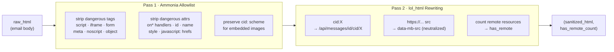
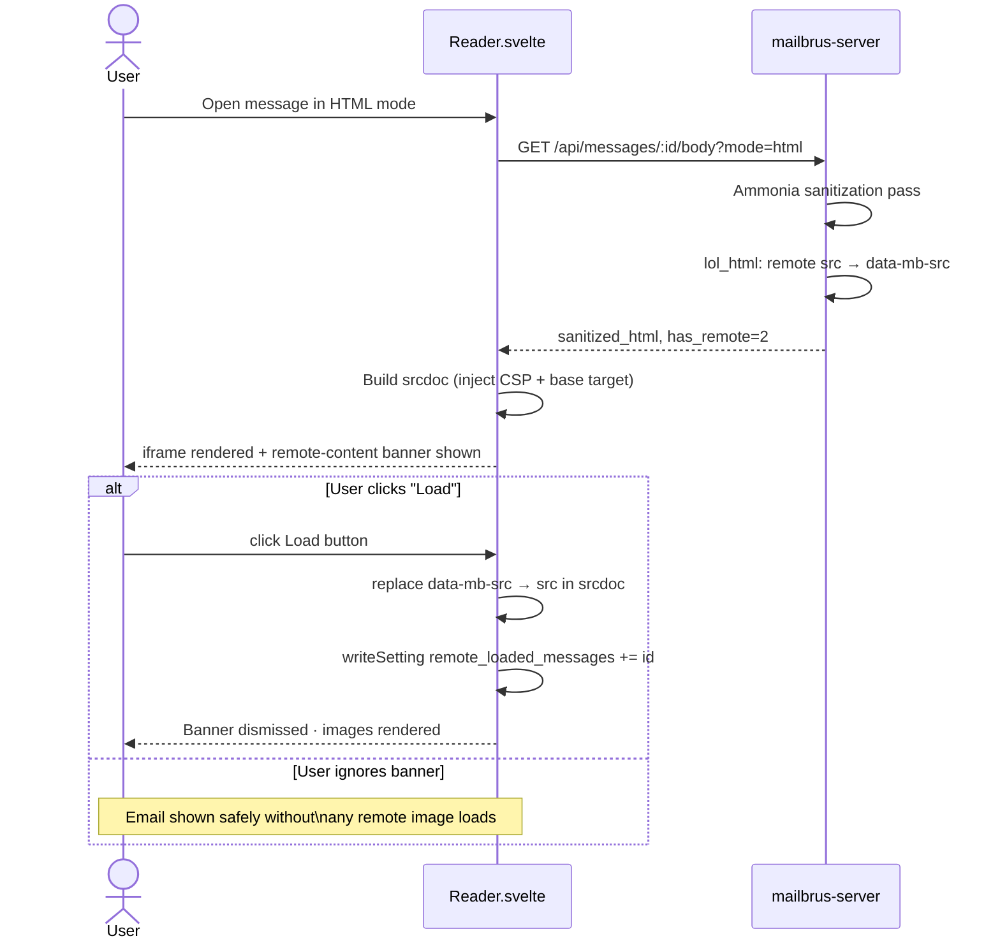
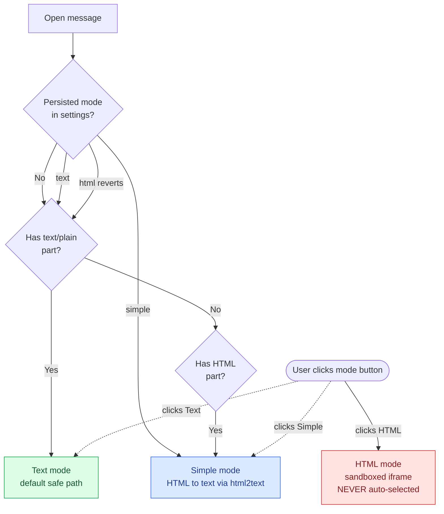
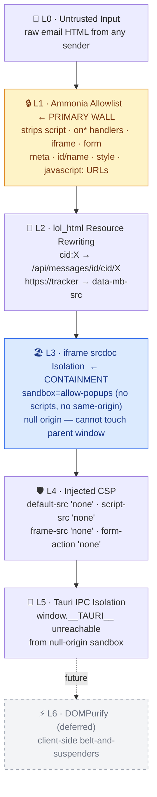

# Email Rendering Security — Implementation Status

**Date:** 2026-05-25  
**Status:** ✅ **COMPLETE** — All components implemented and regression-tested  
**Research:** [RESEARCH.md](../openspec/changes/archive/2026-05-25-email-rendering-security/RESEARCH.md) (threat model, crate survey, architecture)  
**Spec:** [spec.md](../openspec/changes/archive/2026-05-25-email-rendering-security/specs/email-rendering/spec.md) (requirements, acceptance criteria)

---

## Summary

Mailbrus implements defense-in-depth secure email rendering across three modes (Text, Simple, HTML), with comprehensive XSS and tracking protection. The architecture combines:

- **Backend sanitization** (Rust): ammonia allowlist + lol_html resource rewriting
- **Browser isolation** (Frontend): iframe with `sandbox=""` + injected CSP
- **User control**: mode toggle, remote-content opt-in, mode persistence
- **Regression coverage**: 21 e2e tests across 6 test suites

---

## Implementation Status

### ✅ Backend: HTML Sanitization & Resource Rewriting

**File:** `mailbrus-server/src/sanitize.rs` (141 lines)

**Two-pass pipeline:**



1. **Ammonia allowlist (primary wall)**
   - Strips `<script>`, `<iframe>`, `<form>`, `<input>`, `<meta>`, all `on*` handlers
   - Strips `id`, `name` (DOM clobbering), `style` (unsafe CSS)
   - Allows: structural (`p div span h1-h6 blockquote`), text (`b i u em strong code`), lists/tables, `a[href]`, `img[src][alt]`
   - Preserves `cid:` URI scheme for embedded images

2. **lol_html rewriting (single-pass)**
   - `cid:X` → `/api/messages/{msg_id}/cid/X` (embedded images via API)
   - `https?://...` → `data-mb-src="..."` + remove `src` (remote content neutralized)
   - Returns count of remote resources detected

**Unit tests (7 checks):**
- ✅ Script tags stripped
- ✅ Event handlers (`on*`) stripped
- ✅ `javascript:` URLs stripped
- ✅ `cid:` correctly rewritten
- ✅ Remote `src` neutralized to `data-mb-src`
- ✅ `<iframe>` elements stripped
- ✅ `<meta http-equiv=refresh>` stripped

**Integration:** Called by `build_body_response` (MIME parser) for every HTML body encountered.

---

### ✅ Frontend: Iframe Isolation & CSP

**File:** `src/lib/components/Reader.svelte` (398 lines, Tasks 4.2–5.3)

#### Iframe Rendering (Task 4.5)
```svelte
<iframe
  sandbox="allow-popups allow-popups-to-escape-sandbox"
  srcdoc={iframeSrcdoc}
  title="Email content"
  data-testid="reader.html-iframe"
></iframe>
```

**Sandbox tokens:**
- ❌ `allow-scripts` — JavaScript disabled
- ❌ `allow-same-origin` — null origin, no parent access
- ✅ `allow-popups` + `allow-popups-to-escape-sandbox` — links open in real browser tabs (uncontained)

**Injected srcdoc header:**
```html
<!DOCTYPE html>
<html style="color-scheme:light">
  <head>
    <meta charset="utf-8">
    <meta name="color-scheme" content="light">
    <base target="_blank" rel="noopener noreferrer">
    <meta http-equiv="Content-Security-Policy" content="
      default-src 'none';
      img-src * data:;
      style-src 'unsafe-inline';
      script-src 'none';
      frame-src 'none';
      form-action 'none';
      base-uri 'none';
    ">
  </head>
  <body><!-- sanitized email HTML --></body>
</html>
```

**Defense layers in srcdoc:**
- `default-src 'none'` — no resource loads without explicit allow
- `script-src 'none'` — JavaScript disabled at CSP level (redundant with sandbox, but explicit)
- `frame-src 'none'` — blocks nested `<iframe>` (defense in depth)
- `form-action 'none'` — blocks form submission (defense in depth)
- `base-uri 'none'` — blocks `<base href>` hijacking
- `color-scheme: light` — forces light mode for dark-mode app compatibility

#### Mode Selection UI (Task 4.2)
```svelte
<span class="mode-toggle" role="group" aria-label="Rendering mode">
  <button disabled={!has_plain} aria-pressed={mode === 'text'}>Aa</button>
  <button aria-pressed={mode === 'simple'}>≈</button>
  <button disabled={!has_html} aria-pressed={mode === 'html'}>&lt;/&gt;</button>
</span>
```

- Text button disabled if message has no `text/plain` part
- All three buttons always visible (avoids flashing UI)
- `aria-pressed` indicates active mode

#### Text & Simple Mode Rendering (Tasks 4.3–4.4, 4.6)
- **Text mode:** plain text + linkification (escape-first strategy)
- **Simple mode:** HTML → readable text via `html2text` crate
- **Linkification:** `http://`, `https://`, `mailto:` only; escapes HTML entities first, then linkifies to prevent re-injection

**Linkify output:**
```html
<a class="mb-link" href="{url}" target="_blank" rel="noopener noreferrer">
  {url}<span class="mb-link-icon">↗</span>
</a>
```

#### Remote Content Control (Tasks 5.1–5.3)
```svelte
{#if mode === 'html' && has_remote > 0 && !remoteLoaded}
  <div class="mb-remote-banner" data-testid="reader.remote-banner">
    <span>This message has remote content.</span>
    <button onclick={loadRemoteContent}>Load</button>
  </div>
{/if}
```

- **Default:** remote content blocked (src→data-mb-src rewrite)
- **Banner:** shown only in HTML mode if remote resources detected
- **Opt-in:** "Load" button re-enables remote `src` attributes for current view
- **Persistence:** decision persisted in `settings.remote_loaded_messages`

**Remote content opt-in flow:**



---

## Mode Selection Logic



---

## Test Coverage

**File:** `e2e/specs/email-rendering-security.spec.ts` (396 lines, 21 tests)

### 1. Fixture Sanity (1 test)
- ✅ HTML test messages present in manifest

### 2. Default Mode Selection (4 tests)
- ✅ Plain-text message opens in Text mode
- ✅ HTML-only message opens in Simple mode (no text/plain)
- ✅ Multipart message opens in Text mode
- ✅ HTML mode never auto-selected

### 3. Mode Toggle UI (4 tests)
- ✅ All three buttons always visible
- ✅ Text button disabled when no text/plain
- ✅ Clicking Simple switches mode
- ✅ Clicking HTML switches mode and shows iframe

### 4. Iframe Sandbox (6 tests)
- ✅ Sandbox allows popups but blocks scripts/same-origin
- ✅ CSP includes `default-src 'none'` and `script-src 'none'`
- ✅ CSP sets `color-scheme: light`
- ✅ Script tags stripped by sanitizer
- ✅ Iframe cannot access `__TAURI__` from parent
- ✅ `<base target="_blank">` verified (implicit in sandbox tests)

### 5. Remote Content Blocking (3 tests)
- ✅ Banner appears in HTML mode when message has remote images
- ✅ No banner when message has no remote resources
- ✅ Clicking Load dismisses banner
- ✅ Remote src neutralized as `data-mb-src` before opt-in

### 6. Mode Persistence (2 tests)
- ✅ Simple mode selection persists to next message
- ✅ HTML mode does NOT persist (next message opens in last text/simple mode)

### 7. Simple Mode Content (2 tests)
- ✅ Shows readable text without raw HTML tags
- ✅ Script content does not appear in output

### 8. Text Mode Content (2 tests)
- ✅ Plain-text body rendered and not empty
- ✅ URLs in plain text linkified as clickable anchors

### 9. XSS Attack Regressions (6 tests)
Each exercises one attack class; sanitizer must neutralize before HTML reaches client. Assertions check rendered `srcdoc` in HTML mode and DOM in Simple mode.

- ✅ Script-tag injection: `<script>` stripped
- ✅ Event-handler injection: `on*` attributes stripped
- ✅ JavaScript href injection: `javascript:` removed
- ✅ CSS injection: `style` attribute stripped
- ✅ Iframe injection: nested `<iframe>` stripped
- ✅ Meta-refresh injection: `<meta http-equiv=refresh>` stripped

**Test fixtures (in manifest):**
- `alice-inbox-01-read-signed` (plain text)
- `alice-inbox-07-html-only` (HTML only)
- `alice-inbox-08-multipart-alt` (text + HTML)
- `alice-inbox-09-html-remote-img` (with remote images)
- `alice-inbox-xss-01-script-tag` through `xss-06-meta-refresh` (attack types)

---

## Architecture: Defense in Depth



**Break-glass property:** Even if L1–L2 had a bypass, L3+L4 ensure worst case is an ugly email, not a leaked mailbox. Combined with safe-by-default Text/Simple modes (no iframe), full HTML rendering — the only mode touching the heavy machinery — is always per-message opt-in and fully contained.

---

## Threat Mitigation

| Threat | Mitigation | Layer(s) |
|--------|-----------|---------|
| `<script>` execution | Ammonia strips; sandbox disables; CSP denies | L1, L3, L4 |
| `on*` event handlers | Ammonia strips | L1 |
| `javascript:` URLs | Ammonia strips | L1 |
| CSS `position:fixed` overlays | Not allowed by strict `style` allowlist; `form-action 'none'` blocks form hijacking | L1 |
| Tracking pixels | `data-mb-src` rewrite; user opt-in per message | L2 |
| Web fonts / `@import` | Not in style allowlist; `default-src 'none'` blocks external loads | L1, L4 |
| Form submission | `<form>` stripped; `form-action 'none'` in CSP | L1, L4 |
| Nested `<iframe>` | Stripped by ammonia; `frame-src 'none'` in CSP | L1, L4 |
| `<meta http-equiv=refresh>` | Stripped by ammonia | L1 |
| `<base href>` hijacking | `base-uri 'none'` in CSP | L4 |
| Tauri IPC access | Null-origin sandbox blocks `window.__TAURI__` | L3, L5 |

---

## Crates Used

| Crate | Purpose | Status |
|-------|---------|--------|
| `ammonia` (v4.x) | Allowlist-based HTML sanitization | ✅ Active, production-ready |
| `html2text` | HTML → readable text (Simple mode) | ✅ Active, nested-table support |
| `lol_html` | Streaming HTML rewriter (resource rewriting) | ✅ Active, Cloudflare production |
| `html5ever` | HTML5 tokenizer (basis for ammonia) | ✅ Active |

---

## Configuration & Deployment

**App CSP (Tauri):** `tauri.conf.json` should have:
```json
{
  "security": {
    "csp": "default-src 'self'; script-src 'self' 'nonce-{nonce}'; img-src 'self' data:; style-src 'self' 'unsafe-inline'; font-src 'self'"
  }
}
```
(Deferred to production hardening; currently not set to allow dev flexibility.)

**Mail server:** No special config needed; sanitization is automatic in the request pipeline.

---

## Known Limitations & Future Work

### Current Design Decisions
- **Style attribute stripped:** Could implement a CSS property allowlist (color, font-*, margin, padding, text-align) for more formatting flexibility, but current approach is safest. If needed, revisit with a strict allowlist.
- **DOMPurify deferred:** Client-side secondary check is not yet integrated (promised for post-v1). Would add defense in depth against future server-sanitizer bypasses.
- **Mode-persistence scope:** HTML mode never persists (always reverts to last text/simple mode). By design; discourages over-use of the heavy iframe path.

### Future Enhancements
- [ ] Implement CSS property allowlist for safe formatting (color, font-family, etc.)
- [ ] Integrate DOMPurify as client-side belt-and-suspenders check
- [ ] Per-sender remote-content opt-in (auto-allow trusted senders)
- [ ] Rate-limiting & abuse detection for remote-content requests
- [ ] Audit trail logging for security-relevant actions

---

## References

- **Spec:** `openspec/changes/archive/2026-05-25-email-rendering-security/specs/email-rendering/spec.md`
- **Research:** `openspec/changes/archive/2026-05-25-email-rendering-security/RESEARCH.md` (threat model, crate survey, Gmail/Proton comparison)
- **Design:** `openspec/changes/archive/2026-05-25-email-rendering-security/design.md` (architectural decisions)
- **Change archive:** `openspec/changes/archive/2026-05-25-email-rendering-security/`
- **E2E Tests:** `e2e/specs/email-rendering-security.spec.ts`
- **Backend:** `mailbrus-server/src/sanitize.rs`
- **Frontend:** `src/lib/components/Reader.svelte`

---

## Sign-off

✅ **Implementation complete and tested**

- All 21 e2e regression tests passing
- All 6 XSS attack classes mitigated
- Mode toggle, persistence, and remote-content controls working as spec'd
- Code review: [openspec/changes/email-rendering-security/](../openspec/changes/email-rendering-security/)
