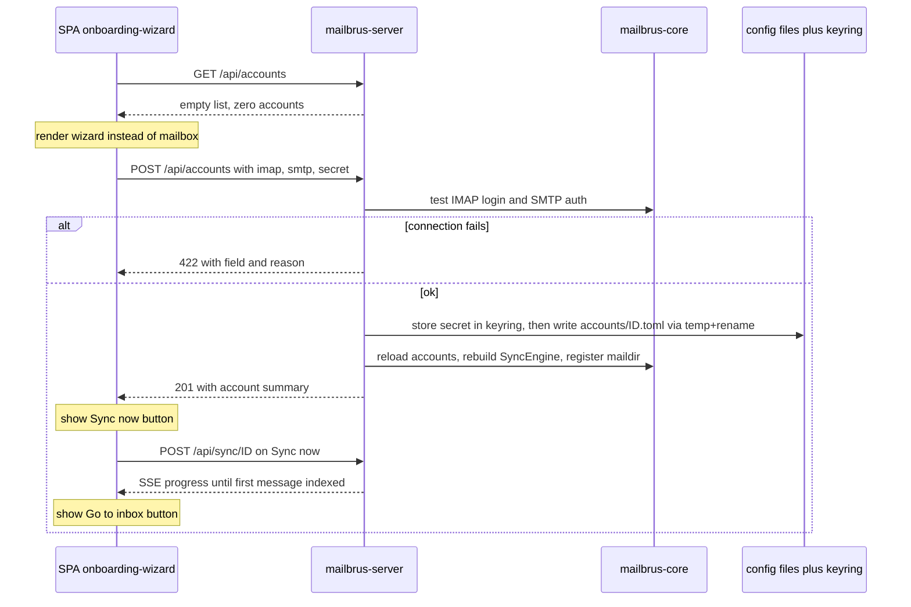

## Context

On first launch Mailbrus is unusable: the server logs
`[startup] loaded 0 account(s) from config` (`mailbrus-server/src/main.rs:56`),
disables the sync engine (`main.rs:113`), and the SPA renders an empty mailbox.
Adding an account today means hand-editing `~/.config/mailbrus/config.toml` and
provisioning a credential out-of-band. This design wires an in-window
account-editing component into that first-run path.

Current state that constrains the design:

- **Config is load-only and single-file.** `load_config()` parses a
  `[accounts.<id>]` TOML map (`RawConfigFile { accounts: HashMap<String, toml::Value> }`)
  from one `config.toml` into `Vec<AccountConfig>`. `AccountConfig`/`ImapConfig`
  derive only `Deserialize`. This change replaces that file with per-account
  files (see Decision 3) — a BREAKING load-path change.
- **Credentials are read-only.** `credentials::resolve()` reads from keyring /
  pass / plain; there is no write path.
- **No SMTP in the config model.** `ImapConfig` has no SMTP fields; `SmtpSender`
  takes credentials at the call site (see `smtp-sender` spec).
- **Accounts are immutable at runtime.** `AppState.accounts: Arc<Vec<AccountConfig>>`
  and `sync_engine: Option<Arc<SyncEngine>>` are built once at startup; the
  engine is `None` while no accounts exist.
- **Frontend derives accounts from `/api/maildirs`** (`src/lib/api.ts:31`), which
  reflects notmuch-indexed dirs — empty for a brand-new account until first sync.

## Goals / Non-Goals

**Goals:**
- Detect the zero-account state in the SPA and render the account-editing
  component as a full-window onboarding wizard.
- Persist a new IMAP+SMTP account to its own `accounts/<email>.toml` and store its
  secret, then make the account live (syncable) without a server restart.
- Validate the entered settings against the real servers (IMAP login + SMTP AUTH)
  before persisting, so a broken account is never written.
- Build the component reusably so a future Settings "edit account" path can mount
  it unchanged.

**Non-Goals:**
- Editing/removing existing accounts through Settings (component is reusable; only
  the create path is wired here).
- Adding more than one account during onboarding.
- IMAP/SMTP autodiscovery, JMAP, and OAuth credential flows.
- Writing to the `pass` store from the UI (read-only / advanced; manual setup).
- Implementing the outbound send path (`/api/send` is a stub today; wiring it to
  the stored SMTP settings is a separate follow-up change).

## Flow

## Decisions

**1. Dedicated `GET /api/accounts` for the empty-state trigger (not `/maildirs`).**
Maildirs are empty for a new account until first sync, so reusing them would
flash the wizard after a real account is added. A summary endpoint
(`id`, `email`, `protocol`, `display_name`) reports configured accounts directly.
*Alternative:* reuse `/maildirs` — rejected; conflates "no account" with "not yet
synced".

**2. `POST /api/accounts` validates-then-persists.**
The handler attempts a real IMAP login (reusing the sync IMAP connect path) and
SMTP auth with the supplied secret before writing anything. On failure it returns
`422` with the offending field/reason for inline display.
*Alternative:* persist first, surface errors on first sync — rejected; leaves dead
account files on disk and a confusing UX.

**3. One TOML file per account; drop the shared `config.toml` (BREAKING).**
Accounts live at `~/.config/mailbrus/accounts/<email>.toml`, one account per
file, fields at the top level (no `[accounts.<id>]` wrapper). The **account id is
the email address**, and the filename stem *is* that id (e.g.
`accounts/alice@example.com.toml`). The same email-derived id is the maildir
parent path (`$XDG_DATA_HOME/mailbrus/mail/<email>/`). `load_config` scans the
`accounts/` directory and parses each `*.toml`; `config.toml` is no longer read.
Creating an account is then writing a *new* file atomically (write to a temp file
in the same dir, `fsync`, rename) — no read-modify-write of a shared file, no
merge, no clobbering other accounts. Deleting an account is removing its file.
Because the id reaches `/api/sync/<id>`, route handlers and the client must
percent-encode it (`encodeURIComponent`, already used in `src/lib/api.ts`).
*Alternatives:* (a) keep one `config.toml` and append via `toml_edit` — rejected;
shared-file read-modify-write risks clobbering hand-written entries/comments and
needs id-collision handling inside the file. (b) Load both legacy + per-account —
rejected by product decision; the format change is accepted as BREAKING.

**4. Credential backends offered: keyring (default) and plain; pass excluded.**
The wizard writes the secret via `keyring::Entry::set_password` under a
`credential_ref` equal to the account's email address (= the account id), so it
is stable and collision-free by construction. `plain` is offered
with an explicit insecurity warning (stored inline in TOML). `pass` requires a
configured GPG store and recipients, so it stays read-only/manual.
*Alternative:* support all three — rejected for now; pass-write is high-friction.

**5. Add SMTP fields to the account model and validate them; do not wire `/api/send`.**
Extend the account entry with `smtp_host`, `smtp_port`, `smtp_starttls`,
defaulting to `587`/STARTTLS, reusing the account's credential for SMTP auth.
Onboarding validation (Decision 2) connects and performs SMTP `AUTH` (no message
sent) so a working account is captured. **Scope boundary:** `/api/send` is a stub
today (`handlers/push.rs` returns `{"ok": true}` and `SmtpSender` has no caller),
and actually wiring it to read the stored SMTP/credential and call
`SmtpSender::send` is left to a dedicated "implement sending" change. This change
only persists the fields and proves they authenticate.
*Alternative:* also wire `/api/send` here — rejected (this round) as a separate,
larger concern orthogonal to onboarding; see Open Questions for the handoff.

**6. Live reload via a swappable state cell + reused startup wiring.**
Wrap the account list and sync engine in `arc_swap::ArcSwap` (or `Mutex<Arc<…>>`)
in `AppState`. A `reload_accounts()` routine re-runs the existing startup steps
(load config → resolve maildir roots → register in notmuch → `SyncEngine::new`)
and atomically swaps them in. The common onboarding case is the `0 → 1` transition
where `sync_engine` goes from `None` to `Some`.
*Alternative:* signal the Tauri shell to restart the sidecar — rejected as the
default; heavier and drops in-flight SSE/sync. (Kept as a fallback if reload
proves unstable.)

**7. Per-account signature/footer field, applied with the `-- ` delimiter.**
Add an optional multi-line `signature` field to the account entry, stored in the
account's TOML file and used for that account. When present, outgoing plain-text
mail gets the signature appended after a delimiter line containing exactly `-- `
(dash, dash, **space**) on its own line — the de-facto Usenet/email convention
([RFC 3676 §4.3](https://www.ietf.org/rfc/rfc3676.txt)), emitted as
`\r\n-- \r\n<signature>`. Under `format=flowed` the `-- ` line is sent as-is (not
flowed) so the trailing space survives and receiving clients can auto-trim it on
reply. The wizard collects the footer in a textarea.
*Where it is applied:* the frontend Compose prefills a new message body with the
current account's signature (delimiter included) so the user can see and edit it
before sending. *Alternative:* server appends at send time — rejected as the
default; it hides the footer from the author and complicates HTML/plain handling.

**8. Post-create flow is explicit: "Sync now", then "Go to inbox".**
On a successful create the wizard does **not** auto-sync. The account is validated
but its maildir is empty, so the wizard shows a **Sync now** button that triggers
`POST /api/sync/<id>` and follows progress over the existing `/api/sync/stream`
SSE channel. Once the first message has been fetched and indexed into notmuch, the
wizard surfaces a **Go to inbox** button that navigates into the mailbox view.
*Alternative:* auto-sync and auto-navigate on create — rejected; explicit buttons
give the user control and clear feedback on a first sync that may be slow.

## Risks / Trade-offs

- **Plain secret persisted in the account's TOML file** → default to keyring; show
  an explicit warning when the user picks plain; never log the secret.
- **Partial/corrupt file on write** → write to a temp file in `accounts/` then
  atomic `rename`, so a reader never sees a half-written account file.
- **Duplicate account id (file already exists)** → the create handler rejects
  `409` if `accounts/<id>.toml` exists rather than overwriting another account.
- **One malformed file breaks the whole load** → `load_config` skips an
  unparseable `*.toml` with a warning naming the file, and loads the rest.
- **Sync-engine swap races an in-flight sync** → swap the `Arc` atomically;
  in-flight syncs finish against their captured engine, new requests see the new
  one. Handlers must read accounts/engine through an `AppState` accessor per
  request, not cache a snapshot.
- **Connection test slow/hung server** → bound the validation with a timeout and
  return a clear `422` so the wizard doesn't appear frozen.
- **Email-as-id in routes/filenames** → percent-encode the id in URLs; the email
  is a valid POSIX filename, but reject ids containing `/` or NUL defensively.

## Migration Plan

**BREAKING.** `config.toml` is no longer read; accounts must live in
`accounts/<id>.toml`. No automatic migration is provided (product decision):
existing users re-create their account through the wizard, or hand-write the new
per-account files. Release notes must call this out. Rollback = revert the change;
the old binary resumes reading `config.toml`, but any accounts created via the
wizard (written under `accounts/`) will not be seen by the reverted binary.

## Open Questions

Resolved during review:

- **`/api/send` SMTP source** → confirmed in code: `/api/send` is a *stub*
  (`handlers/push.rs`) and `SmtpSender` has no caller. SMTP settings are stored per
  account here, but consuming them is deferred (Decision 5).
- **Account id** → the email address; it is also the per-account filename stem and
  the maildir parent path (Decision 3).
- **`credential_ref`** → the email address / account id (Decision 4).
- **Post-create sync** → no auto-sync; explicit **Sync now** then **Go to inbox**
  once the first message is fetched and indexed (Decision 8).

Follow-up changes (out of scope here, but unblocked by this one):

- **Implement sending**: wire `/api/send` to resolve the account by `from`
  address, read its stored `smtp_*` + credential, and call `SmtpSender::send`.
  This change's stored fields + validation are the prerequisite.

Still open:

- HTML signatures: the `-- ` convention is plain-text only; defer rich/HTML
  footers to a later change.
