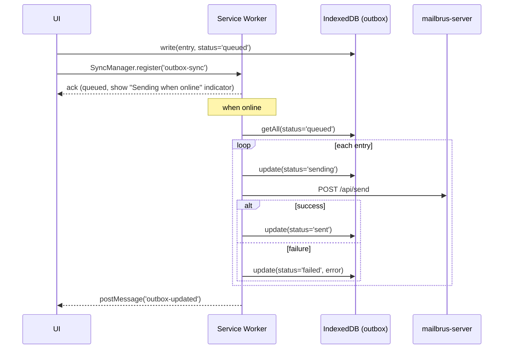
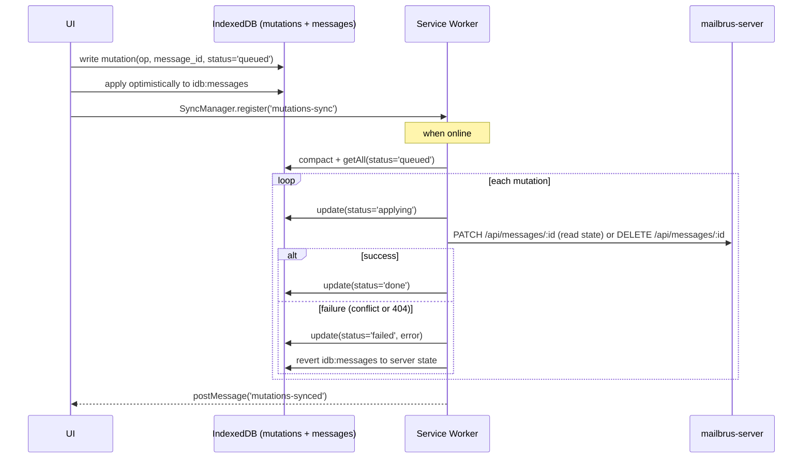

## Context

The mailbrus SvelteKit frontend currently has no offline capability, no installation support, and no local persistence beyond the lifetime of a page session. All state lives in-memory in Svelte stores and is lost on refresh or close.

This design covers the full PWA layer: service worker lifecycle, caching architecture, offline outbox with "not sent" semantics, offline mutations queue (read state, deletions) with server sync on reconnect, local settings persistence, and frecency-ranked modal lists.

The frontend talks to `mailbrus-server` (Rust HTTP sidecar). All PWA storage is client-side; the server needs no changes except a VAPID push endpoint for notifications.

## Goals / Non-Goals

**Goals:**
- Installable on desktop and Android (Web App Manifest + beforeinstallprompt)
- App shell loads instantly from cache on repeat visits
- Recent messages readable offline
- Outgoing messages composed offline are queued, marked "not sent", and sent automatically when connectivity returns
- Read/unread state changes and message deletions made offline are queued and synced to the server on reconnect; local state is applied optimistically
- User settings persisted across sessions and page refreshes
- Modal pickers (folder, contact, search history) ranked by frecency
- Unread badge on installed app icon
- Push notifications for new mail

**Non-Goals:**
- Full offline IMAP sync (too complex, not viable without dedicated sync protocol)
- Attachment downloads cached offline (quota risk; download-on-demand only)
- iOS push notifications (iOS 16.4+ technically possible but UX is too fragmented for v1)
- Periodic Background Sync (not widely supported)

## Decisions

### 1. Storage partitioning: Cache API vs IndexedDB

Two distinct storage layers with different ownership:

| Store | Backend | Contents |
|---|---|---|
| `app-shell-v{n}` | Cache API | HTML, JS bundles, CSS, fonts, icons |
| `message-bodies-v{n}` | Cache API | GET `/api/messages/:id` responses (TTL 7 days) |
| `assets-v{n}` | Cache API | Avatars, static images (TTL 30 days) |
| `idb:outbox` | IndexedDB | Queued outgoing messages with send status |
| `idb:mutations` | IndexedDB | Queued offline mutations: read state, deletions |
| `idb:messages` | IndexedDB | Message metadata (headers, read state, folder) |
| `idb:frecency` | IndexedDB | Per-item frecency weights for modal pickers |
| `idb:settings` | IndexedDB | User preferences |
| `localStorage:theme` | localStorage | Theme preference only (needed before first paint) |

**Rationale:** Cache API owns HTTP-shaped resources (can serve as fetch responses). IndexedDB owns structured application state (outbox, frecency, settings). Theme lives in `localStorage` to prevent flash-of-wrong-theme on initial render before any JS runs.

**Alternative considered:** Store everything in IndexedDB. Rejected because Cache API integrates natively with `FetchEvent` interception — serving cached API responses requires no deserialization.

---

### 2. Outbox queue ("not sent" semantics)

Outgoing messages composed offline (or that fail to send) are stored in `idb:outbox`:

```
OutboxEntry {
  id:         string        // local UUID
  composed_at: ISO timestamp
  status:     'queued' | 'sending' | 'sent' | 'failed'
  error?:     string
  message:    SerializedDraft  // headers + body + attachments
}
```

**Send flow:**



**Fallback (Firefox/Safari):** The app registers an `online` event listener and a `visibilitychange` handler in the main thread to trigger the same flush logic when Background Sync is unavailable. The flush logic is shared code called from both paths.

**UI contract:** The message list shows unsent messages from `idb:outbox` merged with server-fetched messages. Each unsent message displays a "Not sent" badge. The Outbox folder always renders from local IDB first.

---

### 2b. Offline mutations queue (read state, deletions)

Actions taken on messages while offline — marking read/unread, deleting, trashing — are written to `idb:mutations` and applied optimistically to `idb:messages` immediately so the UI reflects the change without waiting for a network round-trip.

**Schema:**

```
MutationEntry {
  id:         string   // local UUID
  message_id: string   // server-side message UID
  folder:     string   // folder the message is in (needed for IMAP ops)
  op:         'mark_read' | 'mark_unread' | 'delete' | 'trash' | 'move'
  args?:      object   // e.g. { target_folder: 'Archive' } for move
  queued_at:  ISO timestamp
  status:     'queued' | 'applying' | 'done' | 'failed'
  error?:     string
}
```

**Compaction:** Before flushing, the queue is compacted per `message_id`: if the same message has multiple read-state changes, only the latest survives. If `delete` appears for a message, all prior read-state mutations for that message are dropped. This prevents redundant server calls and resolves conflicts in favor of the most recent user intent.

**Sync flow (shared with outbox, same Background Sync tag `mutations-sync`):**



**Conflict resolution:** If the server returns 404 (message deleted server-side by another client), the mutation is marked `failed` and the local `idb:messages` entry is purged. If the server returns a conflict (e.g. already read), the server state wins and local is corrected.

**UI contract:** Message list reads from `idb:messages` first (optimistic state). A subtle "syncing…" indicator appears when `mutations` queue has `queued` entries. Deleted messages are hidden from the list immediately; if the deletion fails they reappear with an error indicator.

---

### 3. Frecency algorithm for modal pickers

Affected pickers: folder picker, recipient/contact autocomplete, search history, label picker.

**Algorithm:** Mozilla-style bucket frecency.

Each visit to an item records a timestamp. On query, score is computed as:

```
bucket_weight(age_days):
  ≤ 4    → 100
  ≤ 14   → 70
  ≤ 31   → 50
  ≤ 90   → 30
  older  → 10

frecency(item) = Σ bucket_weight(age_days(visit_i)) / total_visits
               * min(total_visits, 10)   // visit count bonus, capped
```

The score is computed at query time from the stored visit log. Each item stores up to the last 20 visit timestamps (ring buffer) to bound storage.

**IDB schema:**

```
FrecencyEntry {
  store:    string   // 'folders' | 'contacts' | 'searches' | 'labels'
  key:      string   // folder path, email address, search query, label id
  visits:   number[]  // epoch ms, last 20, ring buffer
}
```

**Alternative considered:** Simple hit-count with last-used timestamp (`score = count / age`). Rejected because it over-weights old high-frequency items and under-weights a recently-discovered but not-yet-frequent item (e.g. user just started a new project folder).

---

### 4. Settings persistence

Settings stored in `idb:settings` (key-value), with `localStorage` used only for theme:

| Key | Type | Default | Storage |
|---|---|---|---|
| `theme` | `'dark' \| 'light' \| 'system'` | `'system'` | `localStorage` (anti-flash) |
| `last_folder` | `string` | `'INBOX'` | IndexedDB |
| `search_history` | `string[]` | `[]` | IndexedDB (max 50, MRU order) |
| `sort_order` | `{field, direction}` | `{date, desc}` | IndexedDB |
| `push_subscription` | `PushSubscriptionJSON` | `null` | IndexedDB |

Settings are loaded once at app boot into a Svelte store and written through to IDB on change. The `settings` store is not synced to the server — it is purely local/device-scoped.

**Search history** is stored as a MRU list: each new search prepends to the array, deduplicating by exact string, capped at 50 entries.

---

### 5. Caching strategies per resource type

| Resource | Strategy | Rationale |
|---|---|---|
| App shell (HTML/JS/CSS) | **Cache-first, background update** | Must load instantly offline; stale JS acceptable until next visit |
| `/api/messages?folder=*` (list) | **Network-first, cache fallback** | Show fresh data when online; fall back to stale list when offline |
| `/api/messages/:id` (body) | **Cache-first, 7-day TTL** | Message bodies don't change; avoid re-fetching |
| Avatars, icons | **Cache-first, 30-day TTL** | Static, rarely change |
| `/api/send`, `/api/drafts` | **Network-only, queue on fail** | Mutations must not be silently dropped |
| `PATCH /api/messages/:id` (read state) | **Network-only, queue on fail** | Optimistic local update; server sync via mutations queue |
| `DELETE /api/messages/:id` | **Network-only, queue on fail** | Optimistic local delete; server sync via mutations queue |
| Push subscription endpoint | **Network-only** | No caching — always fresh |

---

### 6. Service Worker tooling

**Decision: custom service worker (TypeScript), no Workbox.**

Rationale: Workbox adds ~30 KB and the caching needs here are straightforward. A hand-written SW keeps the logic transparent and avoids an abstraction layer that obscures the TTL/eviction logic. The SW will be compiled via Vite's `vite-plugin-pwa` solely for the manifest injection and SW registration lifecycle, with the SW implementation written by hand.

**Alternative considered:** Workbox via `vite-plugin-pwa`. Rejected due to complexity of customizing the outbox sync flow within Workbox's strategy model.

---

### 7. Push notification architecture

VAPID key pair generated server-side and stored in `mailbrus-server` config. Server exposes:

- `POST /api/push/subscribe` — store subscription
- `DELETE /api/push/subscribe` — remove subscription
- (Internal) server sends push when new mail arrives via IMAP IDLE or polling

Service worker handles the `push` event and calls `showNotification` with actions `reply` and `archive`. Clicking the notification calls `clients.openWindow` to focus/open the app at the relevant thread.

---

### 8. Console logging

All offline/PWA operations emit structured `console.debug` logs controlled by a **runtime toggle**, not a build-time flag. Logging is available in both development and production builds so that users and support can diagnose issues in the field.

**Toggle mechanism (client):** Logging is enabled when `localStorage.getItem('mailbrus:debug') === 'true'`. Set via browser console: `localStorage.setItem('mailbrus:debug', 'true')` and refresh. Works in the Service Worker context too (SW reads `self.location` and uses `indexedDB` or a shared `BroadcastChannel` to pick up the flag — or simply exposes a `MAILBRUS_DEBUG` variable set at SW registration time via a query param on the SW URL).

**Client-side (Service Worker + main thread):**

| Event | Log |
|---|---|
| SW install / activate / skip-waiting | `[SW] install v{hash}`, `[SW] activate` |
| Cache write / eviction | `[cache:write] {store} {url}` / `[cache:evict] {url} age={days}d` |
| Outbox enqueue / flush / result | `[outbox] queued {id}` / `[outbox] flush {n} entries` / `[outbox] sent {id}` or `failed {id} {error}` |
| Mutation enqueue / compact / result | `[mutations] queued {op} msg={id}` / `[mutations] compact {n}→{m}` / `[mutations] applied {op} msg={id}` or `conflict {id}` |
| Frecency record | `[frecency] {store}:{key} visits={n} score={s}` |
| Settings read/write | `[settings] read {key}={val}` / `[settings] write {key}={val}` |
| Push received / notification shown | `[push] received` / `[push] notify "{title}"` |
| Badge update | `[badge] set {n}` |

**Server-side (mailbrus-server, Rust):**

All PWA-related HTTP endpoints (`/api/send`, `PATCH /api/messages/:id`, `DELETE /api/messages/:id`, `/api/push/*`) log at `DEBUG` level via `tracing`:

```
[pwa] POST /api/send account={acct} msg_id={id}
[pwa] PATCH /api/messages/{id} op=mark_read
[pwa] DELETE /api/messages/{id}
[pwa] push/subscribe account={acct}
[pwa] push/notify account={acct} new_messages={n}
```

Enabled at any time via `RUST_LOG=mailbrus_server::pwa=debug`.

## Risks / Trade-offs

**[Safari/iOS PWA push]** → iOS 16.4+ supports Web Push only for home-screen-installed apps. UX guidance must prompt iOS users to install before enabling notifications. V1 ships without iOS push; add in a follow-up.

**[Background Sync Firefox/Safari]** → Outbox flush will not trigger in the background on Firefox/Safari. The foreground `online` + `visibilitychange` fallback covers most real-world cases (user opens app to check, flush happens). Mitigation: clearly document the limitation; unsent badge remains visible until flush succeeds.

**[Storage eviction on iOS]** → Safari aggressively evicts storage in private browsing and under quota pressure. Mitigation: store only metadata in IDB, not full message bodies; handle QuotaExceededError gracefully by clearing oldest cache entries first.

**[Cache invalidation on SW update]** → Stale app shell served from cache on update. Mitigation: SW registration uses `updateViaCache: 'none'`; new SW activates on next navigation; version the cache names with a build hash.

**[Mutation conflict on reconnect]** → Another client (desktop app, mobile) may have already applied a conflicting change (e.g. message deleted remotely while marked read locally). Mitigation: server-state wins on conflict; local IDB is corrected; UI shows a brief "Changes could not be applied" notice for failed mutations.

**[Frecency cold-start]** → New installs have no frecency data, so pickers show alphabetical order initially. Acceptable — frecency scores accumulate naturally within a few sessions.

**[Outbox IDB as source of truth]** → If the user clears site data, queued unsent messages are lost with no server-side copy. Mitigation: show a clear "Unsent messages will be lost" warning on clear-data; consider a "save draft" path that persists to server.

## Migration Plan

1. Ship Web App Manifest + service worker registration (no caching yet) → enables install prompt with no behavior change
2. Add app-shell cache → offline app loads; API calls fail gracefully with empty states
3. Add `idb:settings` + frecency store → settings persist, pickers improve
4. Add outbox queue + Background Sync → offline send works
4b. Add mutations queue (read state + deletions) → optimistic offline state changes sync on reconnect
5. Add message-body cache → offline read works
6. Add push notification subscription flow + Badging API → notifications and badge live

Each step is independently deployable and non-breaking. Rollback: unregister service worker via `navigator.serviceWorker.getRegistrations()` in a hotfix build.

## Open Questions

- **IMAP IDLE or polling for push triggers?** Server-side decision; affects push notification latency. Polling (60s interval) is simpler for v1.
- **Max message cache size?** Need to define a cap (e.g. 500 messages or 50 MB, whichever first) and an eviction policy (LRU by last-accessed).
- **Multi-account:** Are frecency weights and settings per-account or global? Assume global for v1, per-account key prefix for future.
