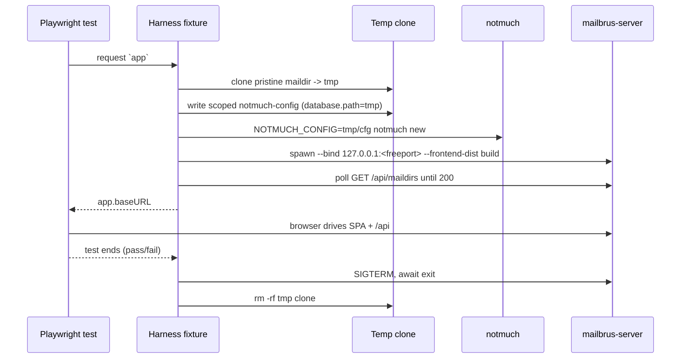

## Context

Mailbrus serves a static SvelteKit SPA (`build/`, adapter-static) from `mailbrus-server` via a fallback `ServeDir`; the SPA talks to a JSON API under `/api`:

- `GET /api/maildirs`
- `GET /api/maildirs/{id}/folders`
- `GET /api/maildirs/{id}/folders/{folder}/messages?page&per_page`
- `GET /api/messages/search?q&page&per_page`
- `GET /api/messages/{id}` · `PATCH /api/messages/{id}` (flags) · `DELETE /api/messages/{id}`
- `POST /api/send`, push endpoints

The reader (`mailbrus-core::MaildirReader::open()`) opens notmuch with `open_with_config(None, ReadOnly, None, None)`, so the database is resolved through notmuch's standard config lookup — i.e. the `NOTMUCH_CONFIG` env var. notmuch derives tags (`unread`, `flagged`, `replied`, `deleted`) from **maildir filename flags** (`:2,S`/`F`/`R`/`T`) and folder/`[new]` config. These two facts are the entire basis for hermetic, code-change-free test isolation.

Constraints: project runtime is Deno (`deno.json`); fixtures must be reviewable in git; tests must not touch the developer's real mailbox or notmuch config.

## Goals / Non-Goals

**Goals:**
- A committed, reviewable maildir corpus exercising every UI-relevant message state.
- Per-test isolation: each test runs against its own freshly cloned, freshly indexed mailbox and its own server, with guaranteed teardown.
- A strictly defined, documented file layout for fixtures, harness, page objects, and specs.
- Runnable as `deno task test:e2e` locally and in CI; parallel-safe.

**Non-Goals:**
- Production code changes to `mailbrus-server` / `mailbrus-core`.
- Sending real email / live SMTP/IMAP (the SMTP path is stubbed/mocked).
- Unit-level coverage (kept in Rust/Vitest), visual regression, or load testing.
- Testing real PGP/S-MIME *verification* — only that the UI renders signed / unsigned / broken-signature messages correctly.

## Decisions

### D1 — Per-test isolation via fixture clone + scoped `NOTMUCH_CONFIG`
Each test: clone pristine maildir → temp dir, write a notmuch config whose `database.path` points at the clone, set `NOTMUCH_CONFIG` for both the indexer and the server child process. No global state is shared.
*Alternatives:* per-worker shared DB (faster, but tests that mutate flags/delete leak into siblings — rejected, the user requires per-test cleanliness); in-process Rust test server (can't drive the real SPA).

### D2 — Commit raw maildir; index per test with `notmuch new`
The repo stores only plain maildir message files (no Xapian DB). The harness runs `notmuch new` against each clone.
*Alternatives:* commit a prebuilt `.notmuch/` and skip indexing (faster, but a binary Xapian DB is unreviewable and tied to a notmuch version — rejected). Corpus is small (tens of messages) so per-test `notmuch new` is sub-second.

### D3 — Encode message state in maildir filenames, not scripts
Read/unread/flagged/replied/deleted are expressed by `cur/`-vs-`new/` placement and `:2,…` flag suffixes, letting `notmuch new` produce tags deterministically with a minimal config.
*Alternative:* post-index `notmuch tag` scripts (more moving parts, drift between filename and tag — rejected).

### D4 — Deno + `npm:@playwright/test` with test-scoped fixtures
The harness is exposed as a Playwright `test.extend` fixture providing an `app` (base URL) per test; setup/teardown live in the fixture so cleanup runs even on failure. Run via Deno's npm compat (`nodeModulesDir: auto` is already set).
*Alternative:* Node runtime (better-trodden Playwright path) — rejected to keep a single runtime per the user's choice; see Risks.

### D5 — Free port per test + explicit `--bind` + health poll
The harness reserves an ephemeral port in TS, passes `--bind 127.0.0.1:<port>`, then polls `GET /api/maildirs` until ready before the test body runs.
*Alternative:* `--bind …:0` and parse the port — the server logs the requested addr, not the OS-assigned one, so the port isn't recoverable. Rejected.

### D6 — Build the frontend once; serve it from the server under test
A global setup ensures `target/release/mailbrus-server` and `build/` exist (build the SPA + cargo binary once per run), then every per-test server is launched with `--frontend-dist build`. Static assets are read-only and safely shared.
*Alternative:* point Playwright at the Vite dev server and mock the API — rejected; we want to exercise the real server + notmuch path end-to-end.

### D7 — File organization
```
e2e/
  playwright.config.ts          # projects, workers, webServer disabled (harness owns servers)
  tsconfig.json
  README.md                     # how to run, how to add fixtures/specs
  fixtures/
    maildir/                    # PRISTINE, committed, READ-ONLY corpus
      alice@example.com/
        Inbox/{cur,new,tmp}/
        Sent/  Archive/  Spam/  Trash/
      bob@example.com/ ...
    manifest.ts                 # typed source-of-truth: accounts, folders, expected messages & states
  harness/
    clone.ts                    # copy pristine -> Deno.makeTempDir(); recursive cleanup
    notmuch.ts                  # write scoped config, run `notmuch new`
    server.ts                   # spawn mailbrus-server, health-poll, stop
    fixtures.ts                 # test.extend({ app }) wiring clone+index+server+teardown
  pages/                        # page objects: MailListPage, FolderNav, MessagePage, ...
  specs/
    maildirs.spec.ts  folders.spec.ts  pagination.spec.ts
    message-read.spec.ts  attachments.spec.ts  signatures.spec.ts
```
The fixture maildir tree and `manifest.ts` are the contract: specs assert against the manifest, never against hard-coded literals.

### Per-test lifecycle



## Risks / Trade-offs

- **Playwright test runner under Deno is less battle-tested than Node** → pin `@playwright/test`, keep `nodeModulesDir: auto`, smoke-test the runner in CI early; if blocked, the documented fallback is running the runner via Deno's node compat / a thin Node shim (no test code changes).
- **Per-test clone + index + server spawn is slow** → corpus stays small; parallel Playwright workers (each fully isolated) amortize wall-clock; cap `workers` in CI.
- **`notmuch new` may read the developer's real config/home** → always set `NOTMUCH_CONFIG` explicitly for indexer *and* server; never rely on defaults; assert the resolved DB path is inside the temp dir before the test runs.
- **Free-port reserve→bind race** → reserve, immediately close, bind with a short retry loop; treat health-poll timeout as setup failure.
- **Leftover temp dirs on hard crash** → namespaced prefix (`mailbrus-e2e-`) + CI workspace cleanup.
- **notmuch binary / browsers absent in CI** → global setup fails fast with a clear message; CI installs both as explicit steps.
- **Fixture realism drift** (states the UI gains but the corpus lacks) → `manifest.ts` is the single source of truth; adding UI states requires updating the manifest + corpus together.

## Migration Plan

Purely additive — no runtime/production impact.
1. Add `e2e/` tree, pristine fixture, harness, page objects, specs.
2. Add `test:e2e` (and a `build`-deps) task; add a CI job installing notmuch + Playwright browsers.
3. Land specs incrementally (start with `maildirs`/`folders` smoke, then pagination/read/attachments/signatures).
*Rollback:* delete `e2e/`, the task entry, and the CI job. Nothing else references it.

## Open Questions

- Does `deno run -A npm:@playwright/test test` drive the runner cleanly, or is a minimal Node shim needed? (Resolve in the first harness task.)
- Should an optional `--notmuch-config` flag be added to `mailbrus-server` as a clearer alternative to the `NOTMUCH_CONFIG` env var? (Env var is sufficient; flag is a nice-to-have, deferred.)
- ~~How are broken signatures best represented in raw `.eml`?~~ **Deferred** — the broken-signature fixture and its spec scenario are out of scope for the first implementation pass; signed/unsigned variants land first, broken-signature is sequenced last as optional.
- ~~Trash semantics for `DELETE /api/messages/{id}`?~~ **Resolved** — deletion is modelled as *move to the account's `Trash/` folder*; the corpus places trashed messages in `Trash/` and assertions check folder membership.
