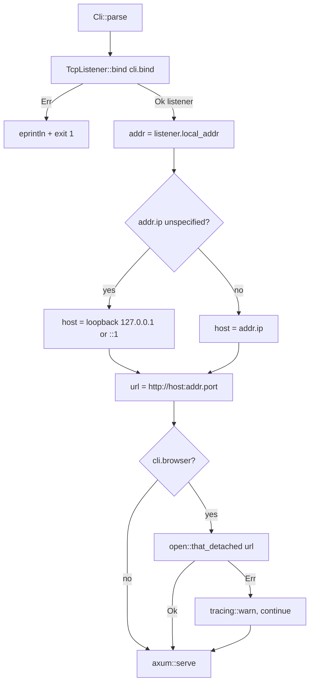

## Context

`mailbrus-server` is a single-binary Axum HTTP server (`mailbrus-server/src/main.rs`) that serves the SvelteKit frontend and a JSON API. Today, `main()` parses CLI flags (`--bind`, `--frontend-dist`, `--auth`), binds a `tokio::net::TcpListener`, prints `Listening on http://{bind_addr}`, and calls `axum::serve(...).await`. The user must then manually open the printed URL.

This change adds an opt-in `--browser` flag that opens the default browser at the running server's URL. The motivating constraint is **dynamic ports**: when the user binds to `127.0.0.1:0`, the OS chooses an ephemeral port, so the URL is only knowable after the listener binds.

Constraints:
- `mailbrus-server` is a standalone binary; it cannot reuse Tauri's runtime opener.
- Must work on Linux, macOS, and Windows (the project ships a Tauri desktop app on all three).
- Default behavior must not change (the flag is strictly additive and off by default).

See `proposal.md` for motivation and `specs/mailbrus-server-crate/spec.md` for the normative requirement and scenarios.

## Goals / Non-Goals

**Goals:**
- Add a `--browser` boolean flag that opens the OS default browser at the server URL after a successful bind.
- Build the URL from the listener's *actual* bound address so ephemeral ports (`:0`) resolve correctly.
- Keep the feature cross-platform with minimal dependency cost.
- Make launch failures non-fatal and non-blocking.

**Non-Goals:**
- Auto-opening the browser by default.
- Selecting a specific browser or honoring `$BROWSER`.
- Headless/CI auto-detection.
- Changing default bind address or the existing `Listening on …` log behavior.

## Decisions

### Decision 1: Use the `open` crate (not `webbrowser`, not manual shell-out)

Use [`open`](https://docs.rs/open) v5 (`open = "5"`) and call `open::that_detached(url)`.

**Rationale:** `open` v5.3.5 is **already present in `Cargo.lock`** (pulled in transitively via the Tauri desktop dependency tree / `tauri-plugin-opener`). Declaring it as a direct dependency of `mailbrus-server` therefore adds *no new crate* to the workspace build graph — only a dependency edge to an already-compiled, already-vetted version. `open` resolves the OS default handler per platform (`xdg-open` on Linux, `open` on macOS, `cmd /c start` on Windows) and even handles WSL via its `is-wsl` dependency.

**Alternatives considered:**
- `webbrowser` crate — comparable one-line API, but it is *not* in the lockfile, so it would add a brand-new crate (and its transitive deps) purely for this. Its browser-selection features are unneeded.
- Manual `std::process::Command` shelling per `cfg!(target_os)` — re-implements exactly what `open` already does, with more surface for bugs (quoting, WSL, `start`'s empty-title quirk).

### Decision 2: Build the URL from `listener.local_addr()`, mapping unspecified IPs to loopback

After `TcpListener::bind` succeeds, read the concrete `SocketAddr` via `listener.local_addr()` rather than reusing the parsed `cli.bind`. Two resolution rules apply when constructing the browser URL:

1. **Ephemeral port:** `--bind 127.0.0.1:0` → `local_addr()` reports the real assigned port → URL uses that port (never `:0`).
2. **Unspecified host:** `--bind 0.0.0.0:9000` (or `[::]:9000`) → `local_addr()` reports `0.0.0.0:9000`, which browsers cannot open. Substitute loopback for the URL host: `0.0.0.0` → `127.0.0.1`, `::` → `[::1]`. The listener is unchanged; only the *displayed/opened* URL is rewritten.

**Rationale:** `cli.bind` is a pre-resolution string; only `local_addr()` reflects what the OS actually granted. The loopback substitution is required because an unspecified bind address is a listen target, not a connect target.

### Decision 3: Open after bind, before `axum::serve().await`

Sequence: parse → bind → compute resolved URL → (if `--browser`) launch browser, non-fatal → `axum::serve`.

**Rationale:** The listener must exist before we can read `local_addr()`. Because `TcpListener::bind` already creates a listening socket with a backlog, the browser's first connection is queued by the kernel and accepted as soon as `axum::serve` runs — so opening before `serve().await` cannot race into a connection-refused.

### Decision 4: Non-blocking and non-fatal launch

Use `open::that_detached(url)` so the launcher process is detached and the call cannot block the async runtime; match on its `Result` and downgrade failures to `tracing::warn!`, then continue to `serve`.

**Rationale:** `open::that` returns after spawning the launcher but can block briefly on some platforms; `that_detached` avoids that. A missing browser (headless box, no default handler) must never take the server down — satisfies the "non-fatal" and "does not block serving" scenarios.

### Decision 5: Flag shape

Add `#[arg(long)] browser: bool` to the existing `Cli` struct, mirroring the style of the current flags. clap renders a `bool` as a presence flag defaulting to `false`.

### Startup flow

## Risks / Trade-offs

- **Unspecified bind yields a non-browsable URL** → mapped to loopback for the URL only (Decision 2). Listener behavior unchanged.
- **Browser opens before the accept loop runs** → kernel backlog queues the connection until `axum::serve` accepts it (Decision 3); no extra delay needed.
- **`open::that` blocking on some platforms** → use `open::that_detached` (Decision 4).
- **`--browser` in a headless/CI environment** → launch fails, logged as a warning, server keeps serving; acceptable per spec. Users in CI simply omit the flag.
- **New direct dependency edge** → mitigated: the crate (and exact version 5.3.5) is already in the lockfile, so there is no new download and no version-unification risk; pinning `open = "5"` matches the locked version.

## Migration Plan

Purely additive and opt-in; no migration, data, or config changes. Deploy = ship the new binary. Rollback = revert the `main.rs` flag handling and remove the `open` dependency line; no state to clean up.

## Open Questions

1. Should the spec gain an explicit scenario for the `--bind 0.0.0.0:PORT --browser` → loopback-URL case? The behavior is specified here in Decision 2; adding a scenario would make it test-enforced. (Recommended.)
2. Should `info!("Listening on …")` also print the resolved (post-`local_addr`) URL, so the ephemeral-port URL is visible even without `--browser`? Minor UX win; currently out of scope.
