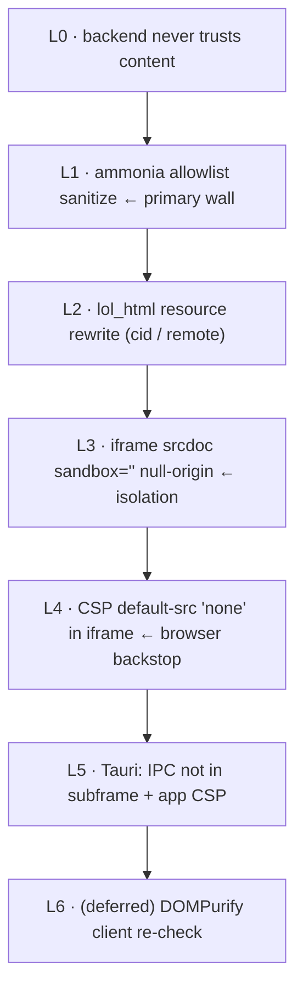

# RESEARCH — Secure Email Rendering for mailbrus

Background research underpinning the `email-rendering-security` change. Compiled 2026-05-22 from Perplexity Sonar Deep Research (two passes: threat-model/architecture, and Rust crate survey), cross-checked against the Rust ecosystem and known mail-client implementations. This is a reference document; design decisions live in [design.md](./design.md).

---

## 1. Threat model for rendering untrusted email

Email is untrusted content from arbitrary senders, rendered without user consent in a *trusted* application context. Effectively the renderer becomes a browser pointed at hostile input. The attack surface, in rough order of severity for a single-user client:

- **Script execution / XSS** — `<script>` tags, `on*` event handlers (`onload`, `onerror`, `onmouseover`, …, on virtually every element), and `javascript:`/`vbscript:` URI schemes in `href`/`src`. Successful execution in the app origin grants access to the *entire mailbox* via the API — far worse than single-site XSS.
- **CSS-based attacks** — `position:fixed/absolute` overlays for clickjacking/redress; CSS exfiltration via attribute selectors + `@import`/`url()` (leaks DOM content without JS); animation/transition timing channels; revived `:visited` history sniffing via timing.
- **Remote-resource / tracking leaks** — tracking pixels (1×1 transparent images) confirm the address is live; remote images, background images, web fonts, and `<link rel=prefetch>` all phone home. Resource-timing can probe the user's internal network (`http://intranet/`, `http://printserver/`).
- **Form submission / phishing** — `<form action="https://attacker">` plus clickjacking captures credentials inside a trusted-looking UI.
- **Webview / IPC (Tauri-specific)** — email content reaching `window.__TAURI__` or a `tauri://`/custom protocol could invoke native commands; desktop privilege makes consequences more severe than in a browser.
- **Privacy side-channels** — clipboard/geolocation/Web Share APIs, `performance.now()` fingerprinting, font/plugin enumeration.
- **Engine vulnerabilities & emerging vectors** — use-after-free in CSS/layout engines, WebAssembly payloads bypassing JS-focused filters, IDN homograph links, cache poisoning. These argue for *containment*, since no filter catches everything.

**Right-sizing for mailbrus (single-user, self-hosted Maildir):** the dominant risk is execution-in-app-origin (mailbox exfiltration) and, under Tauri, IPC. Tracking/privacy matters because the *user* is the target. Multi-tenant/enterprise concerns (policy engines, per-role profiles, threat-intel feeds) do **not** apply.

---

## 2. HTML sanitization

**Where: server-side, before any browser parser sees the content.** Client-side sanitization alone is insufficient — once untrusted HTML reaches the browser's HTML parser, the boundary is already crossed. Tokenizer-based sanitizers (stream of tokens, not a full DOM build) avoid browser-error-correction bypasses and DOM-clobbering.

**`ammonia` (Rust) vs `DOMPurify` (JS):**

| | `ammonia` | `DOMPurify` |
|---|---|---|
| Language / context | Rust, runs in server process, memory-safe | JS, runs in the same context as app code |
| Parser | `html5ever` tokenizer | browser DOM / jsdom |
| Model | allowlist (Builder) | allow/deny config |
| Role for mailbrus | **primary** sanitizer | optional secondary (deferred) |

`DOMPurify` remains valuable as a belt-and-suspenders second layer, but only operating on *already server-sanitized* content. For mailbrus's Rust-first, single-binary architecture, `ammonia` + the iframe backstop is sufficient; DOMPurify is deferred.

**Recommended email allowlist:** allow structural (`p div span br hr blockquote pre`), text (`b i u em strong s sub sup code small`), headings (`h1`–`h6`), lists (`ul ol li dl dt dd`), tables (`table thead tbody tr td th caption`), `a[href]` (http/https/mailto only), `img[src][alt][width][height]`. **Always strip:** `script noscript iframe object embed applet form input button select meta link base`, all `on*` handlers, `id`/`name` (DOM clobbering), and `srcset` (multiplies tracking). The `style` attribute is the hard case — safest is to strip it; a middle path is a CSS *property* allowlist (color, font-*, margin, padding, text-align, border) that blocks `position`, `@import`, remote `url()`, and `expression()`.

**Edge cases:** malformed HTML (browser error-correction can manufacture tags), HTML-entity / numeric-reference double-decoding, Unicode look-alike attribute names, consistency across MIME parts (a malicious link in `text/plain` must be handled too), and quoted reply chains (treat as untrusted).

---

## 3. Remote content & tracking protection

- **Mediate, never allow direct loads.** Rewrite remote `src`/`background`/`url()` to either a neutralized placeholder (blocked) or a same-origin proxy endpoint. A proxy hides the user's IP, strips referrer, enforces timeouts/size limits, and centralizes policy. (Guard against SSRF: scheme allowlist, block private/loopback/link-local ranges, no redirects to private targets.)
- **Block by default, per-message opt-in.** Show a "load remote content" affordance; optionally persist per-sender.
- **`cid:` (Content-ID) inline images** from `multipart/related` are *embedded*, not remote — resolve to a same-origin attachment endpoint and show by default; validate the cid belongs to the message; use unpredictable/scoped lookups.
- **CSP** as a browser-enforced backstop: `default-src 'none'; img-src 'self' …`, explicitly denying `font-src`, `media-src`, `connect-src` unless approved.
- **Resource-type risk tiers:** raster images lowest; **SVG** high (can carry script/DOM) — block or rasterize; **web fonts** can leak via timing — default-block; **external CSS** rarely needed — block. (mailbrus right-sizing: skip image re-encoding/quantization and branding-asset substitution — enterprise overkill.)

---

## 4. iframe isolation — the load-bearing wall

No amount of sanitization is 100%, so the *rendering environment* must contain a breach. Email content must never share the app's origin.

**Sandbox tokens — the critical decision:**
- `allow-same-origin allow-scripts` → **dangerous**, near-zero benefit (email JS runs against the app).
- Omitting `allow-scripts` disables JS execution (email needs none).
- Even then, `allow-same-origin` lets content share cookies/storage → **remove it** to get a null/opaque origin that cannot touch app resources or the parent window.
- Target: `sandbox=""` (optionally `allow-popups allow-popups-to-escape-sandbox` for external links).

**Source:** `srcdoc` gives an opaque origin and avoids origin confusion (relative URLs break — irrelevant once all resources are rewritten to absolute paths). A dedicated `/render` endpoint resolves relative URLs and allows CSP via HTTP header but must still drop `allow-same-origin`. A fully separate origin is the strongest but requires a second host.

**Provider comparison:**

| Client | Isolation approach |
|---|---|
| **Gmail** | each email in an isolated iframe on a separate origin (`mail-*.google.com`), `sandbox` excluding `allow-scripts` and `allow-same-origin`; JS disabled |
| **Proton Mail** | iframe via `about:blank`, no sandbox exceptions beyond `allow-popups`; forms + JS disabled |
| **Thunderbird** | sandboxed display + app-level (XPCOM) content policies; JS disabled |
| **Roundcube** | iframe + CSP; historically weak sandbox config until fixes |

Common thread: **JavaScript execution is disabled entirely** in email content. Gmail/Proton use separate origins because they are multi-tenant SaaS at scale — not a constraint for a self-hosted single-binary client, where `srcdoc` + `sandbox=""` + meta-CSP is the pragmatic equivalent.

**CSP for the email document:**
```
default-src 'none';
img-src 'self' data:;
style-src 'unsafe-inline';
font-src 'none'; script-src 'none'; connect-src 'none';
frame-src 'none'; form-action 'none'; base-uri 'none';
```

---

## 5. Tauri specifics

- Configure a restrictive app CSP in `tauri.conf.json`.
- The injected IPC bridge must not be reachable from the email iframe — a null-origin sandbox (no `allow-same-origin`) prevents access to the parent `window`/`window.__TAURI__`. Add an automated assertion.
- Don't expose `asset:`/custom protocols to email content; route `cid:`/remote resources through the HTTP API only.
- Use Tauri's isolation pattern / capability scoping so commands aren't broadly invocable.

---

## 6. text/plain rendering

- **Escape HTML entities first, then linkify** (never the reverse — it re-introduces injection).
- Linkify only `http`/`https`/`mailto`; validate scheme; beware IDN homographs.
- **`format=flowed` (RFC 3676):** unwrap soft (trailing-space) line breaks into paragraphs.
- Plain text can stay in the app DOM safely (mailbrus already does this); reserve the iframe for HTML mode only.

---

## 7. Rust crate survey (backend pipeline)

Actively maintained as of 2025–2026.

| Crate | Role | Status | Verdict |
|---|---|---|---|
| **`html2text`** (jugglerchris) | HTML → readable text | Active, `html5ever`-based | ✅ **Simple mode.** Best HTML→text: nested tables/lists, footnote-style link preservation, context-aware word wrap, Unicode-aware |
| **`ammonia`** | HTML sanitization allowlist | Active, v4.x, `html5ever` | ✅ **Required.** Gold standard; Builder allowlist; memory-safe; outside JS context |
| **`lol_html`** (Cloudflare) | streaming HTML rewriter | Active, production (Cloudflare Workers) | ✅ **Complement.** Efficient single-pass `cid:`/`src`/`href` rewriting |
| `nanohtml2text` | HTML → text (minimal deps) | Lower fidelity | ❌ Fails on nested-table marketing layouts |
| `mdka` (v1.5) | HTML → Markdown | Active | ⚠️ Only if a Markdown intermediate is wanted |
| `fast_html2md` | HTML → Markdown (fast) | Active | ⚠️ Performance-focused; lower fidelity |
| `htmd` | HTML → Markdown (turndown-style) | Less certain | ⚠️ Skip |
| `dom_smoothie` / `readability-rust` | readability extraction | Niche (v0.5.x) | ❌ Aimed at web *articles*, not email |
| `css-inline` | inline `<style>` into attrs | Active | ❌ Opposite of what we need (we strip CSS) |

**Shortlist: `ammonia` + `html2text` + `lol_html`.** Markdown converters and readability extractors solve a different problem and are not adopted.

---

## 8. Architecture summary (defense in depth)



**Break-glass property:** even if L1–L2 had a bypass, L3+L4 mean the worst case is an ugly/annoying email, not a leaked mailbox. Combined with the 3-mode model (the safe Text/Simple path is the default and uses no iframe), full HTML rendering — the only mode that touches the heavy machinery — is always a deliberate, contained, per-message opt-in.

---

## 9. Sources

Selected sources surfaced by the research (Rust crate pass citations; threat-model pass was synthesized from general web-security and mail-client literature):

- `html2text` — https://github.com/jugglerchris/rust-html2text · https://crates.io/crates/html2text · https://docs.rs/html2text/
- `nanohtml2text` — https://crates.io/crates/nanohtml2text
- `ammonia` — https://github.com/rust-ammonia/ammonia · https://docs.rs/ammonia/ · https://docs.rs/ammonia/latest/ammonia/struct.Builder.html
- `lol_html` — https://github.com/cloudflare/lol-html · https://crates.io/crates/lol_html · https://docs.rs/lol_html/
- `mdka` — https://crates.io/crates/mdka · https://dev.to/nabbisen/mdka-v15-is-out-html-to-markdown-converter-developed-with-rust-2nce
- `fast_html2md` — https://crates.io/crates/fast_html2md
- `htmd` — https://crates.io/crates/htmd · https://docs.rs/htmd
- `html2md` — https://github.com/spider-rs/html2md
- `dom_smoothie` — https://github.com/niklak/dom_smoothie · https://crates.io/crates/dom_smoothie/0.5.1
- `readable-readability` — https://crates.io/crates/readable-readability · `readability-rust` — https://crates.io/crates/readability-rust
- `article_scraper` — https://crates.io/crates/article_scraper
- `css-inline` — https://crates.io/crates/css-inline
- `html5ever` — https://github.com/servo/html5ever
- `mail-parser` — https://crates.io/crates/mail-parser
