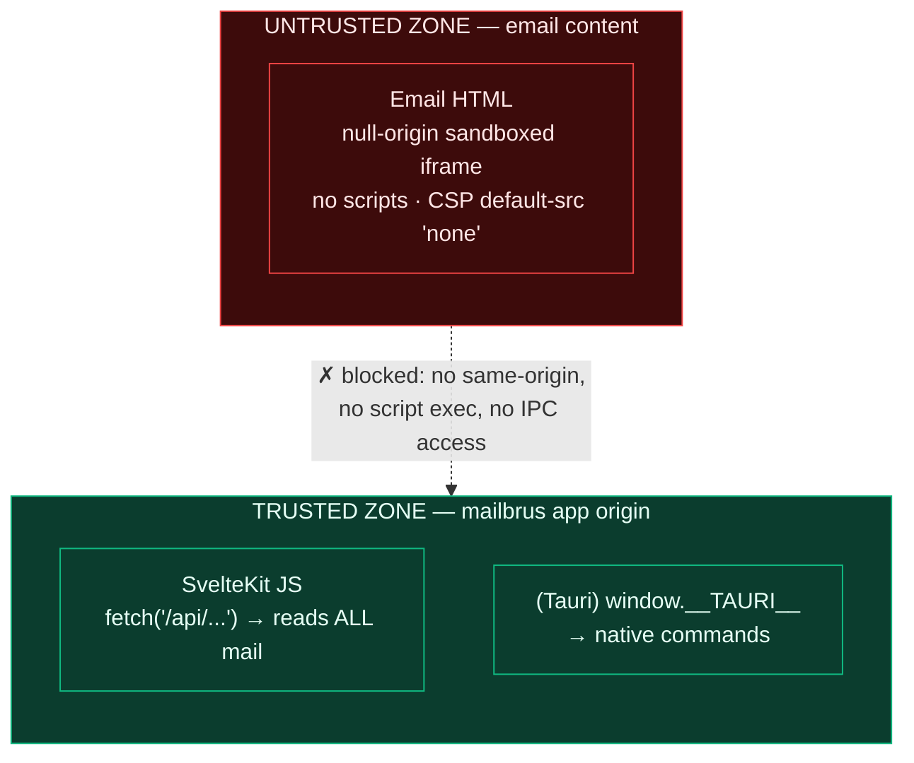
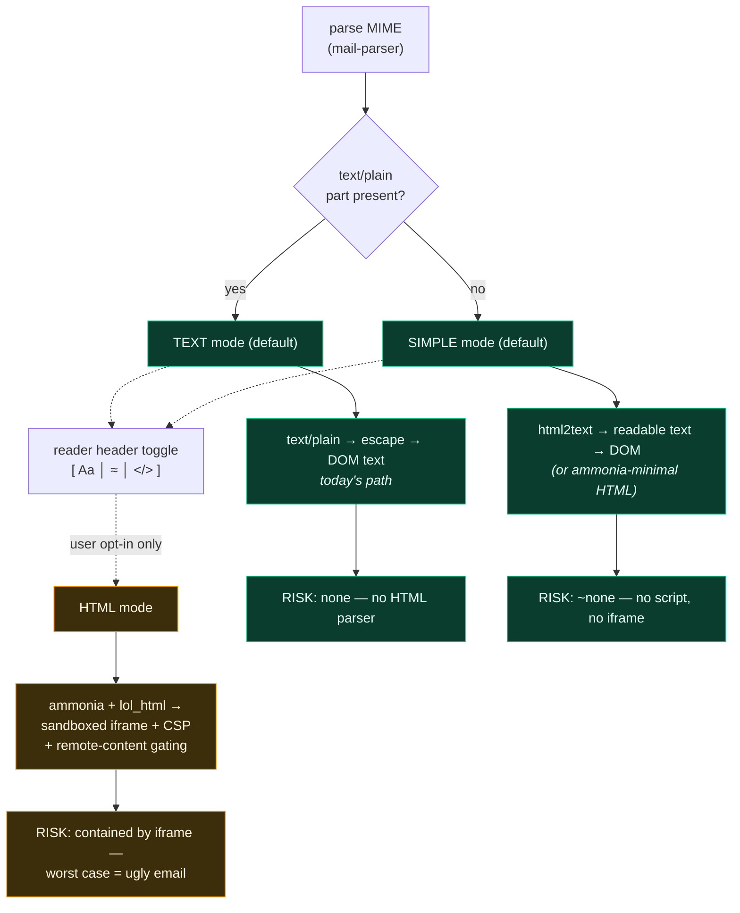
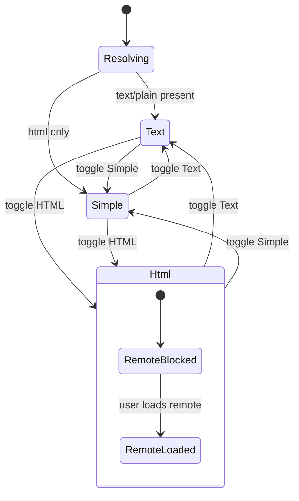
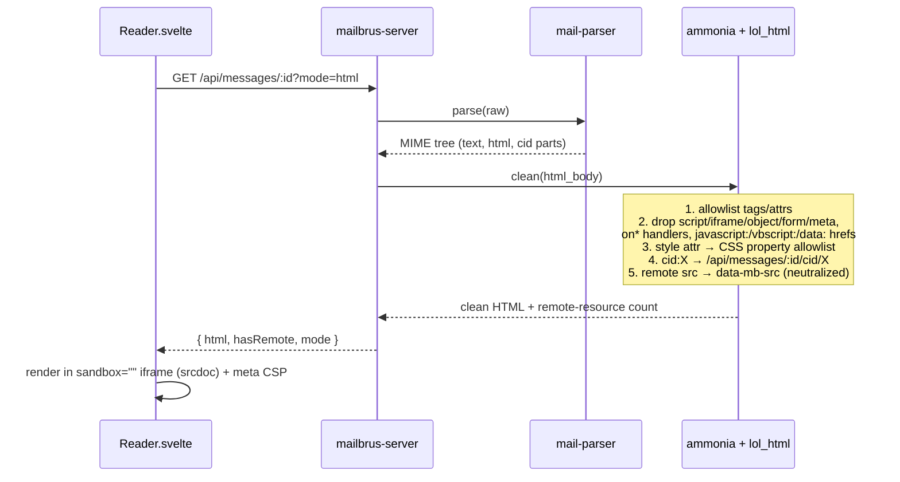
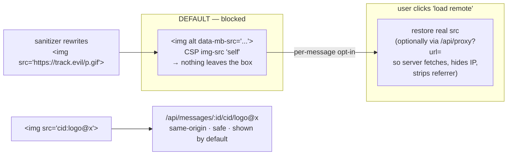

## Context

mailbrus reads a local Maildir and serves it through `mailbrus-server` (Rust HTTP sidecar) to a SvelteKit frontend that runs in two targets: a browser **PWA** and a **Tauri** desktop webview. Today, message bodies are plain text only — `parse_message_body` pulls `text/plain` parts and `Reader.svelte` renders them with Svelte's auto-escaping `{parts.main}`. There is no HTML rendering path.

This design adds HTML email rendering without surrendering that safety. The driving constraint is the **trust boundary**: because mailbrus is a single-user client, the app's own JavaScript origin can read the *entire* mailbox via the API (and, under Tauri, invoke native commands). Therefore the only thing that ultimately matters is whether untrusted email content can ever execute in that origin. Everything else is defense in depth.

See [RESEARCH.md](./RESEARCH.md) for the full threat model, library survey, and provider comparison (Gmail/Proton/Thunderbird/Roundcube) this design is based on.

### The trust boundary



The iframe (without `allow-same-origin`/`allow-scripts`) is the single mechanism that closes both the PWA cookie/session attack and the Tauri IPC attack — one wall, both targets.

## Goals / Non-Goals

**Goals:**
- Render `text/plain` and `text/html` email safely across PWA and Tauri.
- Keep the safe path the default: HTML email is shown as text or simplified-text unless the user explicitly opts into full HTML.
- Block remote content (tracking pixels, remote images/fonts/CSS) by default; offer per-message opt-in.
- Resolve inline `cid:` images to a same-origin endpoint and show them by default.
- Contain any sanitizer bypass inside a sandboxed iframe so the worst case is a broken-looking email, never mailbox exfiltration.

**Non-Goals:**
- Executing JavaScript contained in email (never — there is no legitimate need).
- Pixel-perfect parity with sender-intended layout in Simple mode.
- Enterprise features from the research that don't fit a personal client: policy engines, image re-encoding/quantization, branding-asset substitution, threat-intel domain feeds.
- Outbound HTML composition (this change is about *reading*).
- Client-side DOMPurify as a mandatory layer (deferred; server-side `ammonia` + iframe is sufficient — see Decision 5).

## Decisions

### 1. Three rendering modes; mode selection IS the security boundary

Each mode shrinks the attack surface as it moves toward text. The expensive isolation machinery only runs in HTML mode, which is never auto-selected.



**Default resolution:** `text/plain` exists → TEXT; HTML-only → SIMPLE; HTML mode is only ever reached by an explicit user click. **Sticky preference:** start with a single global default; add an optional per-sender override later, persisted in the `frontend-pwa` settings store (`idb:settings`).

**Simple-mode sub-choice:** `html2text` → plain text (truly zero-risk, fits the keyboard-first aesthetic) is the default. A strict `ammonia`-minimal HTML subset (keeps bold/links/lists, drops CSS/layout/remote) is a documented alternative; we ship the `html2text` variant first.

### 2. Per-message rendering state machine



### 3. Sanitization lives server-side, in Rust

`mailbrus-server::parse_message_body` already holds the parsed MIME tree, attachments, and `cid:` parts — the right place to sanitize. The sanitizer runs *before* any HTML reaches a browser parser. Tokenizer-based `ammonia` (html5ever) avoids the browser-error-correction bypasses that plague naive filters.



**Crate selection** (see RESEARCH.md for the full survey):

| Crate | Role | Why |
|---|---|---|
| `ammonia` (v4.x) | HTML sanitization allowlist | Gold standard, html5ever tokenizer, Builder allowlist, memory-safe, outside JS context |
| `html2text` (jugglerchris) | HTML → readable text (Simple mode) | Handles nested tables/lists, footnote-style link preservation, word-wrap |
| `lol_html` (Cloudflare) | streaming `cid:`/`src`/`href` rewrite | Efficient single-pass attribute rewriting alongside `ammonia` |

Rejected: Markdown converters (`mdka`, `fast_html2md`, `htmd`) — solve a different problem; readability extractors (`dom_smoothie`, `readability-rust`) — aimed at web articles, not email; `css-inline` — inlines CSS, the opposite of what we want.

### 4. Allowlist (email-tuned)

| Category | Allow | Strip / block |
|---|---|---|
| Structure | `p div span br hr blockquote pre` | — |
| Text | `b i u em strong s sub sup code small` | — |
| Headings | `h1`–`h6` | — |
| Lists | `ul ol li dl dt dd` | — |
| Tables | `table thead tbody tr td th caption` | (needed for marketing mail) |
| Links | `a[href]` — `http`/`https`/`mailto` only | `javascript:` `vbscript:` `data:` hrefs |
| Images | `img[src][alt][width][height]` | `srcset` (multiplies tracking) |
| Style | `style=""` via **CSS property allowlist** (color, font-*, margin, padding, text-align, border) | `<style>` blocks, `position:fixed/absolute`, `@import`, remote `url()`, `expression()` |
| Always kill | — | `script noscript iframe object embed applet form input button meta link base` + all `on*` + `id`/`name` (DOM clobbering) |

### 5. iframe isolation: `srcdoc` + `sandbox=""` + meta CSP

For a self-hosted single-binary app, `srcdoc` with an empty sandbox and an injected `<meta>` CSP is the sweet spot — null origin for free, no second host to provision. Gmail/Proton use separate origins because they're multi-tenant SaaS at scale; mailbrus has no such constraint. Because every legitimate resource is rewritten to an absolute `/api/...` path, `srcdoc`'s "relative URLs break" caveat is irrelevant (there are none).

- `sandbox=""` — no scripts, null origin, no forms. Add `allow-popups allow-popups-to-escape-sandbox` only if links should open externally.
- CSP injected into the iframe document:
  ```
  default-src 'none';
  img-src 'self' data:;
  style-src 'unsafe-inline';
  font-src 'none'; script-src 'none'; connect-src 'none';
  frame-src 'none'; form-action 'none'; base-uri 'none';
  ```

Client-side DOMPurify is **deferred**: the trusted path is already Rust `ammonia` + the iframe backstop; adding a JS sanitizer is bundle weight for marginal gain on a personal client.

### 6. Remote content & `cid:` resolution



- **Block remote by default**, show a per-message "load remote content" banner; persist the choice per sender if desired.
- **Proxy vs direct on unblock:** prefer a server-side `/api/proxy` (hides IP, strips referrer, enforces size/time limits, blocks local/private addresses to prevent SSRF). Direct loading is simpler but leaks the user's IP to trackers on unblock.
- **`cid:` inline images** are *embedded*, not remote — resolve to a same-origin endpoint and show by default.

### 7. Tauri hardening

- Confirm the email iframe (null origin, no `allow-same-origin`) cannot reach `window.__TAURI__` or the parent `window`.
- Set a restrictive app-level CSP in `tauri.conf.json`; ensure the IPC bridge is not injected into subframes.
- Do not expose `asset:`/custom protocols to email content; `cid:` and remote resources route through the HTTP API only.

### 8. `text/plain` safety

- **Escape first, then linkify** — never linkify-then-escape (re-introduces injection).
- Linkify only `http`/`https`/`mailto`; validate the scheme.
- **`format=flowed` (RFC 3676):** unwrap soft line breaks (trailing-space continuation) before rendering.
- Plain text stays in the main DOM (already safe); the iframe is reserved exclusively for HTML mode.

## Risks / Trade-offs

**[Sanitizer bypass]** → A novel `ammonia` bypass could let crafted markup survive. Mitigation: the iframe + CSP backstop means a bypass yields a broken email, not code execution in the app origin. This is the whole point of the layering.

**[Simple-mode fidelity loss]** → `html2text` flattens layout; some marketing emails become hard to read. Mitigation: the HTML-mode toggle is one keystroke away for any message.

**[Remote-proxy SSRF]** → `/api/proxy` could be abused to reach internal/localhost services. Mitigation: allowlist schemes, block private/loopback/link-local IP ranges, enforce timeouts and max size, no redirects to private targets.

**[CSS allowlist complexity]** → Per-property CSS filtering is fiddly and a bypass could enable an overlay. Mitigation: in HTML mode the iframe contains overlays harmlessly (nothing to click-jack inside an isolated frame); the conservative fallback is to strip `style` entirely.

**[Tauri IPC exposure]** → If a future Tauri/webview version injects IPC into subframes, the boundary weakens. Mitigation: explicit test asserting `window.__TAURI__` is undefined inside the email iframe; pin/verify on Tauri upgrades.

**[`cid:` reference guessing]** → Predictable `cid:` endpoints could leak attachments across messages. Mitigation: scope the endpoint to `:id` and validate the `cid` belongs to that message.

## Migration Plan

1. Keep TEXT mode exactly as today (no behavior change) — establishes the baseline.
2. Add SIMPLE mode via `html2text` for HTML-only mail → HTML-only messages become readable, still no iframe.
3. Add the reader header mode toggle + persisted preference.
4. Add server-side `ammonia`/`lol_html` sanitization + `cid:` endpoint.
5. Add HTML mode: sandboxed iframe + CSP, remote content blocked by default.
6. Add the "load remote content" banner + optional `/api/proxy`.
7. Tauri CSP/IPC hardening + isolation test.

Each step is independently shippable; steps 1–3 carry no new executable-content risk.

## Open Questions

- **Per-sender vs global mode preference** — global for v1, per-sender override later? (Leaning global first.)
- **`/api/proxy` in v1 or direct-load-on-unblock first?** Proxy is more private but more code; direct is simpler but leaks IP on opt-in.
- **Simple mode: `html2text` only, or offer the `ammonia`-minimal HTML variant as a fourth option?** Ship `html2text` first; revisit if users want structure.
- **Strip `style` entirely vs CSS property allowlist for HTML mode?** Start strict (strip) and loosen if fidelity complaints arise.
