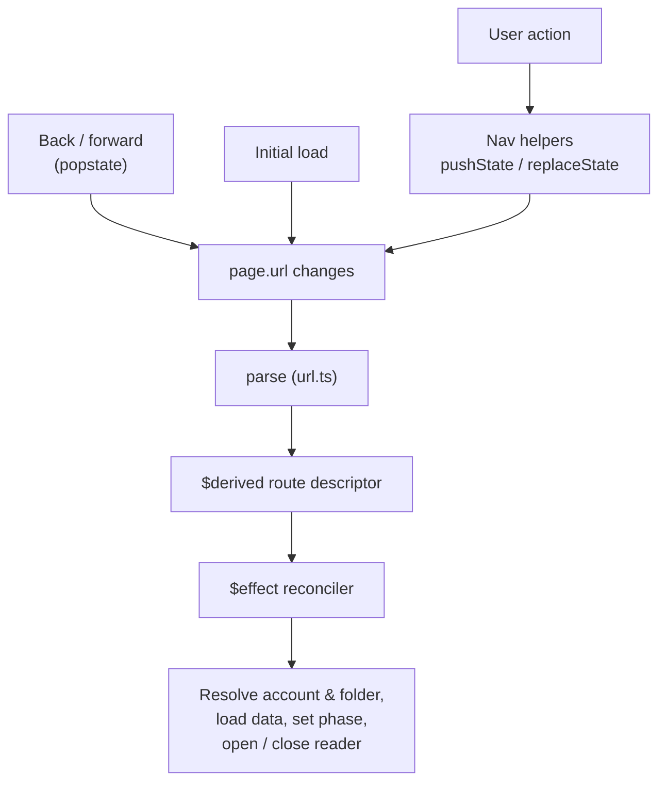
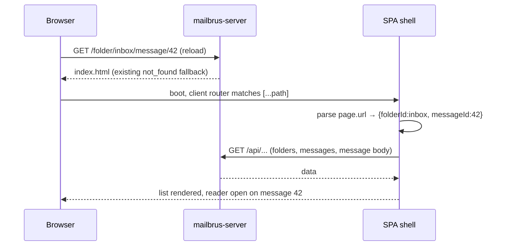

## Context

The SvelteKit frontend is a single-page shell: everything lives in one route
(`src/routes/+page.svelte`) driving an in-memory phase machine
(`account → folder → list`, with reader/compose/search as overlays). The build
uses `@sveltejs/adapter-static` with `prerender = true` and `paths.base = ''`.
There is no URL routing — `window.location` is always `/`, so reload resets to
the account picker and no view is linkable. See `proposal.md` for motivation.

Two existing facts strongly shape this design:

- **The server already does SPA fallback.** `mailbrus-server/src/main.rs` mounts
  `ServeDir::new(dist).not_found_service(ServeFile::new(index.html))` behind
  `fallback_service`. Any non-file path (e.g. `/folder/inbox`) is already served
  `index.html`. **No server change is required.**
- **The data model has no thread/conversation type.** `src/lib/api.ts` exposes
  only `Account`, `Folder`, `Message`, `Attachment`. The UI is a flat message
  list per folder; opening a message shows the reader overlay. There is no
  thread UI to route to today.

A subtlety drives the central decision: SvelteKit's client router resolves
`window.location` against defined routes on every fresh load. With only a `/`
route, reloading a deep URL like `/folder/inbox` boots `index.html`, the client
router finds no matching route, and renders a **client-side 404** — even though
the server returned the shell. Deep-link/reload therefore requires a route that
matches the path grammar, not just server fallback.

## Goals / Non-Goals

**Goals:**
- The URL path reflects the current view (folder, message, search) and is the
  single source of truth for navigation.
- Deep links and reloads restore the matching view.
- Browser back/forward move between views.
- Minimal change to the existing single-shell architecture and zero server change.

**Non-Goals:**
- No SSR, no per-view `+page.svelte`/`load` files, no data-layer changes.
- No compose deep-linking (compose stays an overlay).
- No thread/conversation routing — there is no thread UI yet (see Decisions D5).
- No multi-account path segment in this change (see Open Questions).

## Decisions

### D1 — URL is the single source of truth; one effect syncs the view

Parse `page.url` (from `$app/state`) into a `$derived` route descriptor
`{ folderId?, messageId?, query? }` via a pure mapper in `src/lib/url.ts`. A
single `$effect` observes that descriptor and reconciles app state: load
account/folder/messages as needed, set `phase`, open/close the reader, set
search state. Every entry path — initial load, user action, `popstate` — flows
through this one reconciler.

User actions never mutate `phase` directly for routable transitions; they call
navigation helpers (`navigateToFolder`, `openMessage`, `runSearch`, `goBack`)
that compute a target URL and write history (D3). The effect reads the URL and
updates the view. The effect **never writes** the URL, preventing feedback loops.

*Alternative (rejected):* keep `phase` as source of truth and mirror it to the
URL. Rejected — two sources of truth drift, and back/forward become hard because
history changes must be reverse-mapped into phase.

### D2 — One catch-all route + SPA fallback (keep the single shell)

Move the shell to a catch-all route `src/routes/[...path]/+page.svelte` (a
rest parameter matches `/` too, so the root account picker still works). Switch
the static build to SPA mode:

- `svelte.config.js`: `adapter({ fallback: 'index.html' })`.
- `src/routes/+layout.ts`: `export const ssr = false;` and
  `export const prerender = false;`.

Now any URL boots `index.html`, the client router matches `[...path]`, renders
the shell, and the D1 reconciler restores the view. The server's existing
`index.html` fallback feeds this for free.

*Alternatives (rejected):*
- **Explicit param routes** (`/folder/[folderId]/+page.svelte`, …): idiomatic but
  a large, risky refactor of the ~1000-line shell into layouts + multiple routes
  with shared-state plumbing. Not justified for a single-shell app.
- **Shallow routing over a single `/` route only:** fails the client-router-404
  case above — deep-link reloads render SvelteKit's 404.

### D3 — `pushState` for navigations, `replaceState` for refinements

Use shallow routing from `$app/navigation`. Transitions that should be
reversible with Back use `pushState(targetUrl, state)`: open folder, open
message, run a search. Transient refinements use `replaceState`: search-as-you-type
query edits, density/cursor changes, and any auto-correction of an invalid deep
link. This keeps the history stack meaningful instead of one entry per keystroke.

### D4 — URL grammar

```
/                                         → account picker (or restored start)
/folder/:folderId                         → folder message list
/folder/:folderId/message/:messageId      → message open in reader over the list
/search?q=…                               → search results
```

(Matches the proposal's grammar; `:folderId`/`:messageId` are the API ids.)

### D5 — Threads are out of scope for routing (grammar stays forward-compatible)

There is no thread model or thread UI, so the message is the routable leaf. The
proposal's `/t/:threadId` segment is intentionally **not** implemented here; the
grammar reserves room to insert `/t/:threadId` later between folder and message
without breaking existing links. Captured as an Open Question.

### D6 — Mapping the URL onto the existing phase machine

| URL | Resulting state |
| --- | --- |
| `/` | `phase = 'account'` (account picker) |
| `/folder/:id` | account+folder resolved, `phase = 'list'`, reader closed |
| `/folder/:id/message/:mid` | as above + `openMessage` loaded (reader overlay) |
| `/search?q=` | `searchOpen = true`, `searchQuery = q`, results loaded |

`account` stays app-level state (restored from settings / last-used), not in the
path. Esc and other keyboard shortcuts route through the nav helpers so they
update the URL (e.g. Esc in reader → Back to the list URL; Esc in list → `/`).

### D7 — Invalid deep links degrade gracefully

If a deep link references a missing folder/message (API 404), the reconciler
`replaceState`s to the nearest valid view (folder list, else `/`) with a notice,
so Back never returns to the broken URL.

## Navigation flow

### Reactive URL → view sync

Every entry point — user action, back/forward, or initial load — converges on a
single `page.url` change, which a `$derived` descriptor and one `$effect`
reconciler turn into the rendered view.



### Deep-link reload

Reloading a deep URL is served the app shell by the server's existing
`not_found` fallback; the SPA then boots and rebuilds the view from the path, so
no server change is required.



## Risks / Trade-offs

- **SPA fallback replaces prerendered index** → index.html becomes an empty
  client-booted shell. *Mitigation:* the app already fetches all content
  client-side and shows the account picker first; E2E drives the live app and
  waits for hydration, so no behavior change. Document the prerender→SPA switch.
- **Service worker offline deep-link** → SW precaches only `/`
  (`APP_SHELL_URLS`), so an offline reload of `/folder/inbox` may miss the shell.
  *Mitigation:* add a navigation-request handler in `src/sw.ts` that serves the
  cached `/` shell for any `request.mode === 'navigate'`.
- **Reconciler feedback loop** → effect writing the URL would re-trigger itself.
  *Mitigation:* effect is read-only on the URL; only nav helpers write history.
- **Over-eager history entries** → polluting Back with keystrokes.
  *Mitigation:* D3 pushState/replaceState policy.
- **Esc/keyboard semantics drift** → existing Esc logic bypasses the URL.
  *Mitigation:* route all phase-changing shortcuts through nav helpers; cover with
  E2E.
- **base path** → helpers must honor `paths.base` if it ever becomes non-empty.
  *Mitigation:* build URLs through a single helper that prefixes `base`.

## Migration Plan

Incremental and behavior-preserving at `/`:

1. Add `src/lib/url.ts` (path ↔ descriptor mapper) with unit tests.
2. `git mv src/routes/+page.svelte src/routes/[...path]/+page.svelte`.
3. Set adapter `fallback` + `ssr=false`/`prerender=false` in config/layout.
4. Add the `$derived` descriptor, the reconciler `$effect`, and nav helpers;
   convert existing transitions and Esc handling to call them.
5. Add the SW navigation fallback.
6. Add Playwright E2E: deep-link, reload-restore, back/forward, invalid-link.

**Rollback:** revert the routing files and config flags; the server is untouched,
so reverting frontend changes fully restores the prior single-`/` behavior.

## Open Questions

- **Threads:** when/if a thread UI lands, do we insert `/t/:threadId` (D5) and
  make the message segment relative to it? Grammar is reserved for this.
- **Multi-account:** should the account appear in the path
  (`/a/:accountId/folder/…`) once multiple accounts are supported, or stay
  app-level? Out of scope here; revisit with multi-account work.
- **Search within a folder vs global:** is `/search?q=` always global, or should
  it carry folder scope (`/folder/:id/search?q=`)? Current UI search is global,
  so global for now.
