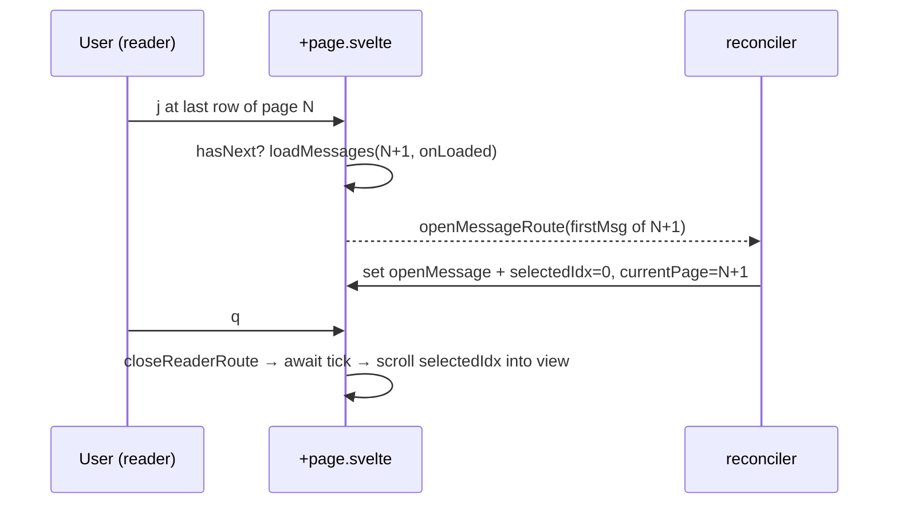

## Context

The reader (`Reader.svelte`) is driven by `src/routes/[...path]/+page.svelte`, which
owns the list/pagination state: `currentMessages` (the loaded page), `selectedIdx`
(index within that page), `currentPage`, `currentPerPage`, `totalCount`, and
`openMessage`. Navigation is URL-driven: `openMessageRoute(folderId, messageId)`
changes the URL, and a single reconciler `$effect` resolves the URL into
`openMessage`/`selectedIdx` by finding the message in `currentMessages`.

Today the reader keymap's `next`/`prev` map to `+page.svelte` handlers that clamp:
`selectedIdx = Math.min(selectedIdx + 1, currentMessages.length - 1)`. They never
call `loadMessages` for an adjacent page, so reading dead-ends at the page edge,
and there is no folder-position indicator in the reader.

## Goals / Non-Goals

**Goals:**
- `j`/`k` traverse the whole folder, loading the next/previous page at the edge.
- A `q` hotkey returns to the list with the current message selected and scrolled
  into view, on whatever page it now lives.
- A `[ index / page / total ]` counter in the reader top panel, each number hinted.

**Non-Goals:**
- No virtualization/infinite scroll; pagination stays page-based.
- No change to the list view's own `j`/`k` clamping or `h`/`l` paging.
- Counter numbers are display-only (not clickable).

## Decisions

**D1 — Reuse the URL reconciler for cross-page open.** At a page edge, the
next/prev handler calls `loadMessages(account.id, folder.id, targetPage, onLoaded)`
and, in `onLoaded(msgs)`, calls `openMessageRoute(folder.id, msgs[edge].id)` —
first message for next, last for prev. The existing reconciler then sets
`openMessage` and `selectedIdx` via `indexOf`. This avoids duplicating
open/selection state logic and keeps a single source of truth.
*Alternative considered:* mutate `openMessage`/`selectedIdx` directly — rejected;
it would bypass the reconciler and risk URL/state drift.

**D2 — Exact end-of-folder detection.** "Has next page" is
`currentPage < Math.ceil(totalCount / currentPerPage)`; "has prev page" is
`currentPage > 1`. Using the exact page count (not the list's
`currentMessages.length >= perPage` heuristic) guarantees a clean no-op at the
absolute first/last message of the folder.

**D3 — `q` and Escape share focus-on-return.** Both close paths route through
`closeReaderRoute(folder.id)` (navigate to the folder URL → reconciler clears
`openMessage`, keeps `selectedIdx`). On return to the list we scroll the selected
row into view. `q` is added purely as an explicit, discoverable binding; the
page-may-have-changed concern is already satisfied because `currentPage`/
`currentMessages` stay in sync with the open message throughout cross-page nav.

**D4 — Counter computed in `+page.svelte`, rendered in `Reader.svelte`.** Pass
`msgIndex = (currentPage − 1)·currentPerPage + selectedIdx + 1`, `pageNum =
currentPage`, `lastPage = Math.ceil(totalCount / currentPerPage)`, `total =
totalCount` as props. The reader renders three ``s in the breadcrumb
`right` snippet, each with a `title`: "Message N of T", "Page P of L",
"T messages in <folder>".

**D5 — Scroll-into-view.** After `closeReaderRoute`, `await tick()` then query
`listEl.querySelector('[data-msg-idx="<selectedIdx>"]')?.scrollIntoView({ block:
'nearest' })`. Reuses the existing `data-msg-idx` attribute on rows.

## Risks / Trade-offs

- **Rapid `j`/`j` across a page boundary mid-load** → the second keypress acts on
  the still-old page. Mitigation: the open is gated on `onLoaded`, so each cross
  resolves before its message opens; a too-fast second press is harmless (re-opens
  within the new page or re-triggers a load). Acceptable for a keyboard UI.
- **Counter shows a stale value during the async page load** → brief, self-correcting
  once the reconciler opens the new message. Acceptable.
- **`scrollIntoView` runs before the list paints** → mitigated by `await tick()`;
  if the row is absent (page mismatch — should not happen per D3) the call no-ops.
