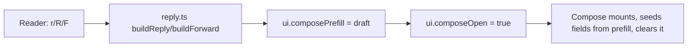

## Context

The reader (`src/lib/components/Reader.svelte`) renders an opened message and registers
a `reader`-scope keymap via `createReaderKeymap` (`src/lib/hotkeys/keymaps/reader.ts`).
The list registers `createListKeymap` in `src/routes/[...path]/+page.svelte`. Compose
(`Compose.svelte`) is a separate phase toggled by `ui.composeOpen` and initializes its
`to/cc/bcc/subject/body` from empty local `$state` — it has **no prefill path** today.

Two relevant constraints surfaced while grounding this design:

1. **No real recipient data on the client.** The `Message` model exposes `from`, `addr`,
   `subject`, `time`, `unread`, `flags` — but no `To`/`Cc` list. `buildHeaders()` in
   `utils.ts` *fabricates* `To`, `Received`, `Message-ID`, etc. for display. Reply-all
   (`R`) needs the original recipients, which are not available frontend-side.
2. **Clipboard requires a secure context / permission.** `navigator.clipboard.writeText`
   works in the SPA and the Tauri webview but needs the page served over a secure origin;
   Playwright must be granted `clipboard-read`/`clipboard-write`.

This change is frontend-only in its happy path (keymap edits + a reply/quote helper +
clipboard), with one possible backend touch for reply-all recipients (see Open Questions).

## Goals / Non-Goals

**Goals:**
- Trim the list g-leader to `g f` / `g a` / `g g` (+ `G`), removing `g i`/`g s`/`g d` and
  the old `g a`=Archive / `g A`=account picker.
- Add reader actions `r` (reply), `R` (reply-all), `F` (forward), `y` (yank body),
  `Y` (yank body+headers), and `g h` (toggle headers menu).
- Keep `f` = hint mode in the reader; `F` is a distinct binding.
- Pure, unit-testable reply/forward/quote construction; E2E for the navigation leaders
  and the reader actions.

**Non-Goals:**
- Threaded/conversation reply UI; reply reuses the existing compose phase.
- User-remappable keybindings.
- Rich-clipboard (HTML/markdown) — yank is plain text.
- Changing list `r` (stays "mark read").

## Decisions

### D1: Reply/forward construction lives in a pure helper (`src/lib/reply.ts`)
A pure module exports `buildReply(message, account, body, {all})` and
`buildForward(message, account, body, headers)` returning
`{ to, cc, subject, body }`. Subject prefixing (`Re:`/`Fwd:`, de-duplicated,
case-insensitive) and `> `-quoting live here.
- **Why:** keeps `Reader.svelte` thin and makes the quoting/subject rules unit-testable
  without DOM. Alternative (inline in Reader) was rejected as untestable and duplicated
  across r/R/F.

### D2: Compose prefill via a shared `composePrefill` value in `ui-state`
Add `composePrefill: ComposeDraft | null` to `ui-state.svelte.ts`. The reader sets it and
flips `composeOpen`; `Compose.svelte` initializes its `$state` fields from it on mount,
then clears it.
- **Why:** mirrors the existing `ui.composeOpen` toggle pattern; no new prop-drilling
  through `+page.svelte`. Alternatives considered: URL query params (pollutes routing) and
  a custom event (harder to test).

### D3: `g h` reuses the reader's existing `showHeaders` state
`Reader.svelte` already has `let showHeaders = $state(false)` driving `HeadersPopover`.
`g h` toggles it; the keymap gets a `['g','h']` leader binding alongside the existing
`['g','g']`.
- **Why:** no new component or state; the popover already exists.

### D4: Yank uses `navigator.clipboard.writeText`
`y` copies the plain-text `body`. `Y` prepends `From`/`To`/`Subject` (+`Date`/`Cc` when
present) drawn from the same `buildHeaders()` rows shown in the popover, then a blank line,
then the body.
- **Why:** standard web API, works in both SPA and Tauri webview, no desktop-only plugin.
  Alternative (Tauri clipboard plugin) rejected — adds a desktop-only dependency for
  behavior the web API already covers.

### D5: Keymap edits
- `list.ts`: remove `g i`/`g a`/`g s`/`g d` and `g A`; keep `g f`, `g g`, `G`; add
  `g a` → account picker (reuse existing `goAccountPicker`). Prune now-unused ctx
  callbacks (`goInbox`/`goArchive`/`goSent`/`goDrafts`).
- `reader.ts`: extend `ReaderKeymapCtx` with `reply`/`replyAll`/`forward`/`yankBody`/
  `yankHeaders`/`toggleHeaders` plus `goFolderPicker`/`goAccountPicker`; add bindings
  `r`/`R`/`F`/`y`/`Y`, the `['g','h']` leader, and the `['g','f']`/`['g','a']`
  navigation leaders (wired to the reader's existing `onFolder`/`onAccount` props).
  Help content updates automatically (keymaps are the single source).

### D6: The g-leader indicator is scope-aware
The on-screen `g` indicator lives in `+page.svelte` and renders while `phase` is
`list` — but the reader keeps `phase === 'list'` (only `openMessage` is set), so the
indicator shows over the reader too. It MUST therefore reflect the active scope's
follow-ups: on the list, `f folder · a account · g top` plus the standalone
`h prev-page · l next-page` page hints; with the reader open, `f folder · a account ·
g top · h headers` and no page hints (`h`/`l` page-nav are list-scope only).
- **Why:** the previous fixed text advertised list bindings (`h prev-page`,
  `l next-page`) that do not fire in the reader, and omitted the reader's `g h`
  headers leader — confusing and wrong. Keying the indicator on `openMessage`
  matches what actually dispatches.

### Reply / forward flow

## Risks / Trade-offs

- **Reply-all needs real recipients (resolved → backend change).** `R` requires the
  original `To`/`Cc`, which the frontend `Message` model lacks. **Decision:** extend
  `mailbrus-core` → `mailbrus-server` → the message API to expose the real `To`/`Cc`
  headers for an opened message, and surface them on the frontend `Message`/reader data so
  `buildReply(..., {all:true})` can populate `Cc` and drop the active account's address.
  This is the one cross-cutting (backend) part of the change.
- **Synthetic headers in `buildHeaders`** → `Y` copies the *displayed* headers (the same
  ones in the popover), which are partly synthetic. Acceptable: yank mirrors what the user
  sees; it is not asserted to be the verbatim wire headers.
- **Clipboard permission in tests** → grant `clipboard-read`/`clipboard-write` in the
  Playwright context for the yank specs; assert via `navigator.clipboard.readText()`.
- **HTML-only messages** → quoting/yank operate on the plain-text `body` the reader
  already holds; for html-mode messages the reader's text body is used (no HTML quoting).

## Migration Plan

Frontend-only and additive for the reader actions; the g-leader change is **BREAKING** for
muscle memory only (no data/API). Ship in one change. Rollback = revert the keymap and
helper edits; no persisted state or schema is touched.

## Open Questions

- **Forward attachments:** forwarding currently carries body+headers text only — should
  original attachments be re-attached? Proposed: out of scope for this change.
