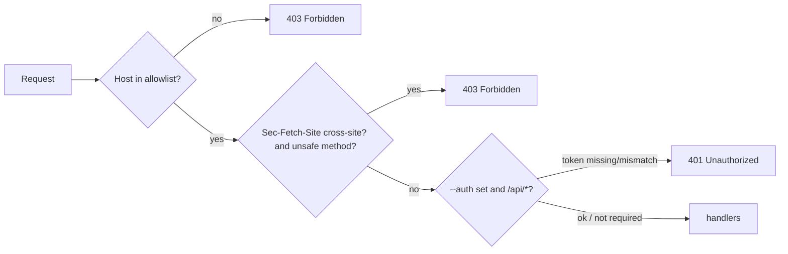

## Context

`mailbrus-server` is an Axum app that serves the SPA and the `/api/*` JSON API on
`127.0.0.1:1371` by default. It is consumed by (a) the Tauri webview loading
`http://127.0.0.1:1371` and (b) an optional plain browser (`--browser`). Today the
request pipeline has only `log_middleware` and `no_store_middleware`; there is no
`Host`, `Origin`, or auth check anywhere, and `--auth` is parsed but never wired
into the router. The threat model is a **local, unauthenticated HTTP server
reachable from the user's browser**, whose canonical failure mode is DNS
rebinding (CWE-346) plus localhost CSRF.

Constraints: single-process, single-user; loopback-only by default; no TLS; the
frontend already centralises API calls in a data layer we can extend to attach a
token.

## Goals / Non-Goals

**Goals:**
- Reject requests whose `Host` is not a known loopback authority (DNS-rebinding defense).
- Reject cross-site unsafe requests that slip through as CORS-"simple" (CSRF residual).
- Make `--auth` a real, enforced bearer-token gate on `/api/*`.
- Keep the legitimate Tauri/browser same-origin path working with zero UX change.

**Non-Goals:**
- TLS/HTTPS, CORS allow-origin support, multi-user auth, or per-account scoping.
- Changing mail/sync/notmuch logic.

## Decisions

### D1: `Host`-allowlist middleware as the outermost layer

A `tower`/Axum `from_fn` middleware validates the request authority (`Host`
header for HTTP/1.1, `:authority` for HTTP/2) against a set built at startup from
the bound `SocketAddr`'s port: `127.0.0.1:<port>`, `localhost:<port>`,
`[::1]:<port>`, plus the literal bound `host:port` when non-loopback. Placed
**outermost** — wrapping both `nest("/api", …)` and the static service — so the
SPA shell is guarded too.

*Alternative considered*: `tower_http` doesn't ship a Host guard; `Origin`-only
checks were rejected because `Origin` is absent on many same-origin GETs and is
attacker-influenceable under rebinding, whereas `Host` is the value the browser is
forced to send and cannot be forged by a rebinding page.

### D2: `Sec-Fetch-Site` check scoped to unsafe methods on `/api/*`

Applied inside the API router (or gated on method) so safe GETs are never blocked
by it. Treat absent/`same-origin`/`none` as allowed; `cross-site`/`same-site` as
denied. This is belt-and-suspenders behind D1 — a modern-browser signal that also
defends the `--browser` (non-Tauri) deployment against classic CSRF.

*Alternative considered*: a CSRF token/double-submit cookie — heavier, needs
frontend state, and unnecessary once Host+Sec-Fetch-Site cover the vectors.

### D3: Enforced bearer token via constant-time compare

When `--auth` is `Some`, an `/api/*`-scoped middleware requires
`Authorization: Bearer <token>` and compares with a constant-time equality
(`subtle`/`ring`-style, or a hand-rolled fixed-time compare) to avoid timing
leaks. Frontend data layer reads the token from its config and adds the header.
Static assets are **not** token-gated (the shell must load to prompt for/hold the
token); Host-allowlist still guards them.

## Risks / Trade-offs

- **[Proxy/rewritten Host breaks allowlist]** → default bind is loopback; document
  that reverse-proxy deployments must forward the expected `Host` or add it via
  `--bind`'s host. Non-loopback binds already warn.
- **[Older browsers omit `Sec-Fetch-Site`]** → absent is treated as allowed, so D1
  (Host) remains the hard guarantee; D2 only tightens where the signal exists.
- **[BREAKING: `--auth` was a silent no-op]** → prior callers who set it got no
  gate; now they must send the token. Called out in the proposal; low blast radius
  (flag was non-functional).
- **[Token in frontend memory]** → acceptable for single-user local app; no
  cookie, so not auto-attached by the browser (CSRF-safe by construction).

## Migration Plan

1. Add middleware + wiring behind the new layers; loopback default behavior is
   unchanged for existing users (no `--auth`, loopback Host).
2. Extend frontend data layer to attach the token when configured.
3. Add integration tests (Rust) for Host/ Sec-Fetch-Site/ auth, and E2E coverage
   (via `mailbrus-e2e-author`) asserting the SPA still boots and the API works
   same-origin. Rollback = revert the middleware layers; no data migration.

## Open Questions

- Where should the browser deployment source the token from — a CLI-printed
  one-time URL fragment, or a config file the frontend reads? (Defer; Tauri path
  needs no token since it's loopback same-origin.)
- Should `localhost` be in the allowlist by default, or only `127.0.0.1`/`[::1]`?
  (Leaning yes — the webview and `--browser` may use either; revisit if it widens
  rebinding surface.)
