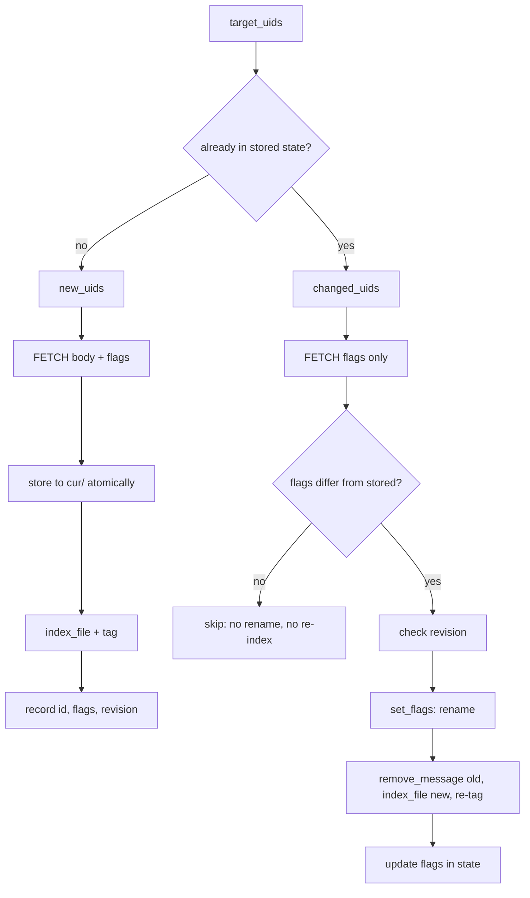

## Context

See `proposal.md` — Why. Requirements are in `specs/imap-sync/spec.md`.

Constraints that shape the approach:

- `ImapWorker::sync_mailbox` is `async` on tokio. Maildir work is local disk I/O
  and today runs **inline and blocking** (`std::fs::write` at `imap.rs:348`),
  which already stalls a runtime worker.
- `index_in_notmuch` (`imap.rs:589`) already holds `notmuch_lock` and does its
  work inside one `spawn_blocking`, opening the DB `ReadWrite` for the batch.
  That is the natural seam for flag re-indexing.
- `io-maildir` 0.3 exposes a blocking std client. All its value types
  (`Maildir`, `MaildirFlags`, `MaildirStore`) are `Clone` and hold only owned
  data — no `Rc`/`RefCell`/raw pointers — so they are `Send` and cross a
  `spawn_blocking` boundary freely.
- `sha2` is already compiled under the `sync` feature (via `imap-client` and
  `secret-service`), so using it costs no new tree entry.

## Goals / Non-Goals

**Goals:**

- One delivery path, atomic, used by both first sync and post-migration resync.
- Flag changes cost a FLAGS fetch and a rename — never a body re-fetch.
- Per-message state keyed by something that survives a rename.

**Non-Goals (design-level, beyond `proposal.md` — Non-goals):**

- No change to the notmuch deletion tombstone. Today a deleted message keeps its
  stale filename in notmuch and gains `tag:deleted`; that stays as-is.
- No change to batch sizing, progress events, or the notmuch lock discipline.
- No parallel delivery. Deliveries stay sequential within a batch.

## Decisions

### D1: Deliver through `io-maildir`'s blocking client, one `spawn_blocking` per batch

`MaildirClient::store(maildir, subdir, flags, contents)` returns
`(String /* id */, MaildirFsPath)`, performing tmp-write → atomic rename and
minting the id from time/pid/hostname.

The worker already processes UIDs in `FETCH_BATCH_SIZE` chunks. Each chunk's
deliveries go into **one** `spawn_blocking`, returning `Vec<(uid, id, path)>`.

*Alternatives:* one `spawn_blocking` per message — a thread hop per message for
work measured in microseconds. Driving the I/O-free coroutines directly against
tokio's async fs — buys nothing, since local disk I/O has no async win, and owns
glue we would throw away.

### D2: Deliver into `cur/`, not `new/`

Synced messages arrive with server-side flags already set, and the maildir
convention forbids an `info` suffix on files in `new/`. Delivering to `cur/` with
flags encoded preserves flag fidelity and matches today's behavior.

*Alternative:* deliver to `new/` and let notmuch move them — loses the server
flags, and would mark already-read mail unread.

### D3: Re-key per-message state to the delivery id; keep UID as the lookup key

```
imap_message_uids
  account_id    TEXT NOT NULL
  mailbox_name  TEXT NOT NULL
  uid           INTEGER NOT NULL
  maildir_id    TEXT NOT NULL   -- was: file_basename
  flags         TEXT NOT NULL   -- last-known server flag set, normalised
  revision      TEXT NOT NULL   -- sha256 of delivered bytes, hex
  PRIMARY KEY (account_id, mailbox_name, uid)
```

`maildir_id` replaces `file_basename` outright rather than sitting beside it —
a dual-key table would preserve the exact coupling this change removes. Paths
are resolved on demand via `client.locate(maildir, id)`.

`flags` is stored normalised (sorted flag chars) so comparison is a string
compare and cannot report a spurious change from ordering.

*Alternative:* keep `file_basename` and re-derive. Rejected: the basename encodes
flags, so it is invalidated by the very operation we need to perform.

### D4: Partition the changed set; fetch flags only for known UIDs

Today `target_uids` is filtered down to UIDs *not* already stored
(`imap.rs:314-318`), discarding the changed set. Replace with a partition:



A body re-fetch for a flag change would be a serious regression on large
mailboxes; `FETCH (FLAGS)` over the changed set is cheap. This needs a new
flags-only fetch alongside the existing `fetch_message_bodies`.

The `flags differ → skip` short-circuit matters: without it every CONDSTORE
sync would rename and re-index every changed message even when the change was
one we already applied.

### D5: A flag rename must be reported to notmuch as remove + re-index

notmuch tracks messages by filename. After `set_flags` renames
`cur/x:2,` → `cur/x:2,S`, notmuch still holds the old path, so a reader would
resolve a file that no longer exists.

Extend `index_in_notmuch` with a third list, `reflagged: Vec<(old_path, new_path)>`,
handled inside the existing `spawn_blocking` and notmuch lock:
`db.remove_message(old)` then `db.index_file(new)`, then re-apply the
`account:` / `mailbox:` tags. notmuch keys the message object by Message-ID, so
the message survives; only its filename set changes.

*Alternative:* shell out to `notmuch new` — slower, and races the API handle we
already hold.

### D6: Revision is a sha256 of the delivered bytes, checked before a rename

The bytes are already in memory at delivery, so recording the hash is free.

The check has exactly one trigger in this change: immediately before a flag
rename, hash the current file and compare. On mismatch, log a warning, emit it
on the progress channel, **still apply the rename** — a rename preserves content,
so nothing is lost — and re-baseline `revision` to the local content so the
warning does not repeat every sync.

*Alternatives:* `(size, mtime)` — no new dependency, but mtime survives a rename
and so cannot distinguish an edit that preserves length. Skipping the rename on
divergence — wedges the mailbox, since the server keeps reporting that UID as
changed forever.

When a local→server path lands later, this signal becomes "upload the local
edit" instead of "re-baseline". That is the point of recording it now.

### D7: Migrate by forced resync, gated on `PRAGMA user_version`

`user_version` avoids adding a metadata table. On open, if `user_version < 2`:
recreate `imap_message_uids` with the new columns, delete all
`imap_mailbox_state` rows so `uid_validity`/`highest_modseq` cursors reset, set
`user_version = 2`.

Resetting the cursors is load-bearing — keeping `highest_modseq` while dropping
per-message rows would make the next CONDSTORE sync fetch only messages changed
since that modseq, permanently skipping everything else.

## Risks / Trade-offs

- **Migration re-downloads every mailbox.** → Accepted deliberately: pre-0.1
  with no released users, and it is the only way to know the existing corpus was
  delivered atomically rather than by the old racy path.
- **Legacy files left in `cur/` after resync.** Re-delivery mints new filenames,
  so old `<uidvalidity>_<uid>.mailbrus:2,` files would linger as duplicates. →
  The migration must delete the old files it knows about (from `file_basename`)
  *before* dropping the column. Sequencing matters: read basenames, unlink, then
  recreate the table.
- **`io-maildir` is edition 2024, floor 1.87.** → Toolchain here is 1.95 and CI
  uses the Nix devShell's rustc; the floor only needs recording in the PR.
- **Re-index churn on a large CONDSTORE delta.** → Bounded by D4's short-circuit;
  only genuinely-changed flags cause work.
- **First direct `sha2` dependency.** → Already compiled under `sync`; if it ever
  leaves the tree this becomes a real (small) addition.
- **notmuch `remove_message` + `index_file` is not atomic.** A crash between them
  leaves the message unindexed until the next sync re-adds it. → Acceptable: the
  file on disk is intact and the next sync repairs the index.

## Migration Plan

1. Open `sync.db`, read `PRAGMA user_version`.
2. If `< 2`: select all `file_basename` values, unlink those files from
   `<maildir_root>/<mailbox>/cur/`, then drop and recreate
   `imap_message_uids` with `maildir_id`/`flags`/`revision`.
3. Delete all `imap_mailbox_state` rows.
4. `PRAGMA user_version = 2`.
5. Next sync sees no cursors and no stored UIDs → full fetch through the atomic
   delivery path.

**Rollback:** an older binary opening a v2 database finds an
`imap_message_uids` without `file_basename` and fails on that column. Rolling
back therefore means deleting `sync.db` and re-syncing; the maildir and notmuch
index are unaffected. Worth stating in the changelog.

## Open Questions

*(Resolved during implementation: the revision-divergence warning got its own
`SyncProgress::RevisionDiverged` variant, alongside `FlagsUpdated`. Both are
rendered by `mailbrus-cli`.)*

## Implementation notes

Three things the implementation settled differently from, or beyond, the plan.

### Legacy unlink is deferred to the worker, not done in the migration

D7 said the migration reads basenames, unlinks the files, then drops the column.
`SyncStateDb` has no knowledge of account maildir roots, so it cannot resolve a
basename to a path. The migration instead copies the basenames into a
`legacy_maildir_files` table before dropping the column, and the sync worker —
which does know the root — drains that table and unlinks before its first
delivery. The ordering guarantee D7 cared about is preserved (basenames are
captured before the column disappears), and this survives a crash between
migration and unlink, which the original plan did not.

### Async helpers must not borrow the state DB

rusqlite's `Connection` is `Send` but not `Sync`, so holding a `&SyncStateDb`
across an `.await` makes the enclosing future non-`Send` and it can no longer be
`tokio::spawn`ed — which `SyncEngine::run_account_worker` requires. The
flag-sync and legacy-purge helpers therefore take owned data and *return* what
needs persisting; all DB writes stay in `sync_mailbox`, which owns the handle.

### Flag comparison must normalise both sides

`MaildirFlags`' `Display` renders letters in **enum-declaration order**
(`P,R,S,T,D,F`), not ASCII order — so `Seen + Flagged` renders as `"SF"` while
the normalised stored column holds `"FS"`. Comparing the raw rendering against
the stored value would report a difference on every sync and rename every
message forever, silently defeating D4's no-op short-circuit. Both sides now go
through `normalize_flags`, and
`stored_flag_comparison_uses_the_same_normalisation_on_both_sides` pins it.

### `index_file` does not apply maildir flag -> tag sync

D5 assumed re-indexing was enough for notmuch to reflect a flag change. It is
not: `notmuch_database_index_file` does **not** run the maildir flag -> tag
mapping — only `notmuch new` does. Since the API derives `seen` as
`!tags.contains("unread")` (`maildir_reader.rs`), a synced message never gained
the `unread` tag and every message read as already-read, making flag
propagation invisible to the app regardless of the rename.

This is a pre-existing defect (the old code had it too), but the change cannot
deliver its stated value without fixing it, so `index_in_notmuch` now calls
`msg.maildir_flags_to_tags()` after every `index_file`. That also keeps
replied/flagged/draft in step with the filename.

### E2E coverage: unblocked, and the harness was the problem

Originally recorded here as blocked by "Stalwart 0.15.5 refuses cleartext IMAP
auth". That explanation was wrong. Cleartext auth is fine — `AUTH=PLAIN` is
advertised with no `LOGINDISABLED`; the sidecar's *principals* were
misconfigured, in two independent ways:

- Stalwart's internal directory authenticates by principal `name`, not by any
  address in `emails`. With `name = "alice"`, `LOGIN alice@test.local` fails.
- Without a `roles` entry the account authenticates and is then denied
  ("Unauthorized access"), closing the socket — which surfaces as an EOF rather
  than an auth error.

With `name = <email>` and `roles = ["user"]`, syncs complete and the session
advertises CONDSTORE + QRESYNC. No TLS listener was needed. All four specs in
`e2e/specs/imap-flag-sync.spec.ts` now run and pass, and two unrelated tests
blocked by the same misdiagnosis (`status-bar.spec.ts`'s completing-sync event
log, `index-events.spec.ts`'s `index:done` frame) are enabled too.

Two further test-integrity fixes came out of this, both of which had been
masking the gap:

- `e2e/harness/global-setup.ts` rebuilt `mailbrus-server` only when the binary
  was **missing**, so the suite silently tested a three-week-old release build.
  It now always rebuilds (warm no-op ~0.2s).
- `injectMail` treated a tagged `NO` as success, so seeding silently did
  nothing. Commands now go through `imapExpectOk`.
