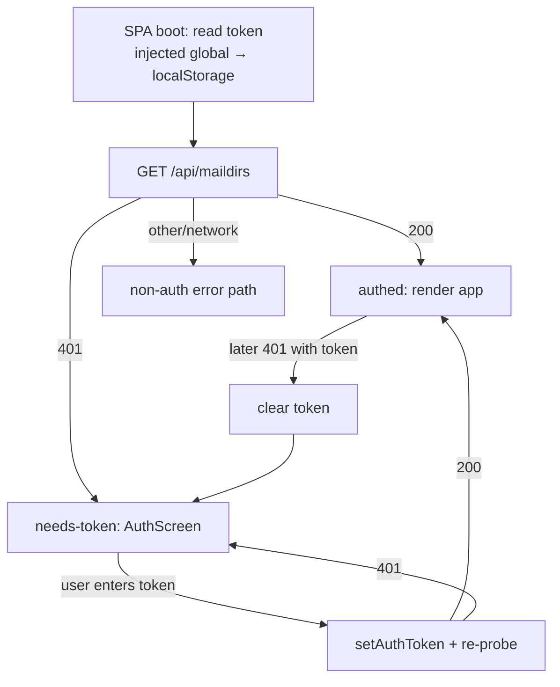

## Context

`mailbrus-server` already enforces a bearer token on `/api/*` when launched with
`--auth <token>` (`api-origin-validation` spec). The frontend already *reads* a token
from `window.__MAILBRUS_AUTH_TOKEN__` or `localStorage['mailbrus.authToken']`
(`src/lib/api.ts:readInitialToken`) and propagates it to localStorage, IndexedDB, and the
service worker (`setAuthToken`). What is missing is **token delivery**:

- The desktop shell (`src-tauri/src/lib.rs`) spawns the sidecar without `--auth` and never
  sets the injected global.
- The browser/PWA has no UI to enter a token, so a server run with `--auth` returns `401`
  for every request and the app appears dead.

Two entry paths need different delivery, and both need recovery when a stored token no
longer matches a restarted server.

Constraints:
- The Tauri window loads the server's HTTP URL (`http://127.0.0.1:1371`), not the
  `asset:` protocol — the SPA runs against real HTTP.
- Tauri capabilities key on the window **label `"main"`** (`src-tauri/capabilities/*.json`)
  — the label must be preserved.
- `initialization_script` must be attached at webview *build* time, so the window must be
  constructed in Rust rather than declared statically in `tauri.conf.json`.
- Several `/api` calls bypass the shared `apiFetch` wrapper (direct `fetch()` in
  `OnboardingWizard.svelte`, `SettingsPanel.svelte`, `mutations.ts`, `outbox.ts`,
  `[...path]/+page.svelte`), so `401` recovery cannot live only in `apiFetch`.

## Goals / Non-Goals

**Goals:**
- Desktop app authenticates automatically with zero user action, and the local API is no
  longer reachable unauthenticated by other loopback processes.
- Browser/PWA users can bootstrap a token through a blocking auth screen when the API
  requires one.
- A stored token that a restarted server rejects is recovered gracefully (cleared +
  re-prompt), never a permanently-dead app.

**Non-Goals:**
- Rotating/expiring tokens or a `/api/auth/refresh` endpoint (rejected — see Decisions).
- Any change to server-side `--auth` semantics or new server endpoints.
- Multi-user auth, password login, or token storage encryption.
- Changing dev mode: `cargo tauri dev` keeps starting the sidecar token-less via
  `beforeDevCommand`.

## Decisions

### D1. Desktop generates a per-launch random token and passes it to the sidecar
The `#[cfg(not(dev))]` setup block generates a 256-bit token, spawns the sidecar with
`--auth <token>` (added to the existing arg list), and injects the same value into the
webview. Token and server process are born and die together, so they can never drift.

- **RNG:** use `getrandom` (already transitively in `Cargo.lock`) to fill 32 bytes,
  hex-encoded to a 64-char string. *Alternative:* `uuid` v4 (122 bits, needs the `v4`
  feature flag). Chosen `getrandom` for higher entropy and no new feature surface.
- **Escaping:** the injected value is produced with `serde_json::to_string(&token)` so it
  is always a valid quoted JS string literal (defensive; the hex token needs no escaping).

### D2. Build the window in Rust with an initialization_script (label `"main"`)
Move the window out of `tauri.conf.json`'s static `windows` array and construct it with
`WebviewWindowBuilder::new(app, "main", WebviewUrl::External(url))`, replicating the
current `title`/size. The builder gets `.initialization_script(&format!("window.__MAILBRUS_AUTH_TOKEN__ = {json};"))`
**only in `#[cfg(not(dev))]`**. The window is built unconditionally (dev + prod); only the
injection and `--auth` are prod-gated.

- Init scripts run before any page script on every navigation/reload, so the global is
  always present and always matches the current server process.
- CSP is unaffected: `initialization_script` is injected by the webview runtime, not an
  inline `<script>`, so `script-src` need not change.
- *Alternative:* keep the config window and `eval()` the global after load — rejected as
  racy (page scripts may run first) and it re-injects on every reload awkwardly.

### D3. Browser auth screen gated in the root layout
`src/routes/+layout.svelte` gains an auth gate backed by a small store with states
`checking → authed | needs-token`. On boot it probes `GET /api/maildirs` (already the
server health probe and the app's first data load — no new endpoint):

- `200` → `authed`, render children.
- `401` with no usable token, or with a token the server rejects → `needs-token`, render a
  blocking `<AuthScreen>` instead of the app.
- Any other status / network error → not an auth problem; fall through to normal app error
  handling (e.g. server still starting).

`<AuthScreen>` takes a token, calls `setAuthToken(token)`, re-probes, and on `200` flips to
`authed`. On desktop the injected global makes the probe succeed immediately, so the screen
never appears in normal operation.

### D4. Stale-token recovery centralized, not per-call
Because direct `fetch()` sites bypass `apiFetch`, recovery lives in one shared helper that
every `/api` response passes through (extend `apiFetch` **and** route the direct callers
through the same response check). On a `401` *when a token was attached*, the helper calls
`setAuthToken(null)` and flips the gate store to `needs-token`. This is the entire
"refresh" story — a stable secret plus re-bootstrap, no timers.

- **Browser:** returns to `<AuthScreen>`.
- **Desktop:** a `401`-with-token is near-unreachable (injected token always matches the
  live process and takes precedence over localStorage). Treated as an error state offering
  a window reload (re-runs the init script); not a primary flow.

### D5. Static secret, no rotation (confirmed with stakeholder)
Threat model is other local processes on loopback, not credential exfiltration, so a token
fixed for the server's lifetime is sufficient. Rotation/expiry would require new server
endpoints, a token store, and clock handling for no security gain on a single-user local
client. Rejected.

## Boot / auth flow

## Risks / Trade-offs

- **Direct `fetch('/api/...')` sites bypass central recovery** → route all `/api` callers
  through the shared response check; add a task to audit the five known sites and a test
  that a mid-session `401` surfaces the auth screen.
- **Window moved to Rust drops config-driven window props** → replicate `title`/size in the
  builder and keep label `"main"` so capabilities keep matching; verify the bundled app
  still opens one correctly-sized window.
- **`Cargo.lock` changes (new `getrandom` direct dep)** → update the shared `cargoHash` in
  `nix/pkgs.nix` in the same commit (per `CLAUDE.md`), else fresh Nix/CI builds break.
- **Desktop `401` has no user-actionable recovery** (user can't know the generated token) →
  acceptable because it is effectively unreachable; offer a reload and log loudly.
- **Token visible in webview memory** → inherent to any bearer scheme on a local HTTP
  server; out of scope, matches existing posture.

## Migration Plan

1. Desktop: add RNG dep, generate token, add `--auth` to sidecar args, build window in Rust
   with init script, trim `tauri.conf.json` `windows`. Update `cargoHash`.
2. Frontend: add gate store + `<AuthScreen>` in `+layout.svelte`; centralize `401`
   recovery; route direct `/api` callers through it.
3. Tests: E2E for browser bootstrap (401 → screen → enter token → app), mid-session stale
   `401` recovery, and desktop auto-auth (injected global → app, no screen).

Rollback: revert the desktop commit (sidecar returns to token-less) and the frontend gate;
no persisted state migration is involved (the localStorage/IDB token keys already exist).

## Open Questions

- Should the browser auth screen offer a "continue without auth" affordance when the probe
  succeeds (server has no `--auth`)? Current design simply never shows the screen in that
  case — likely sufficient.
